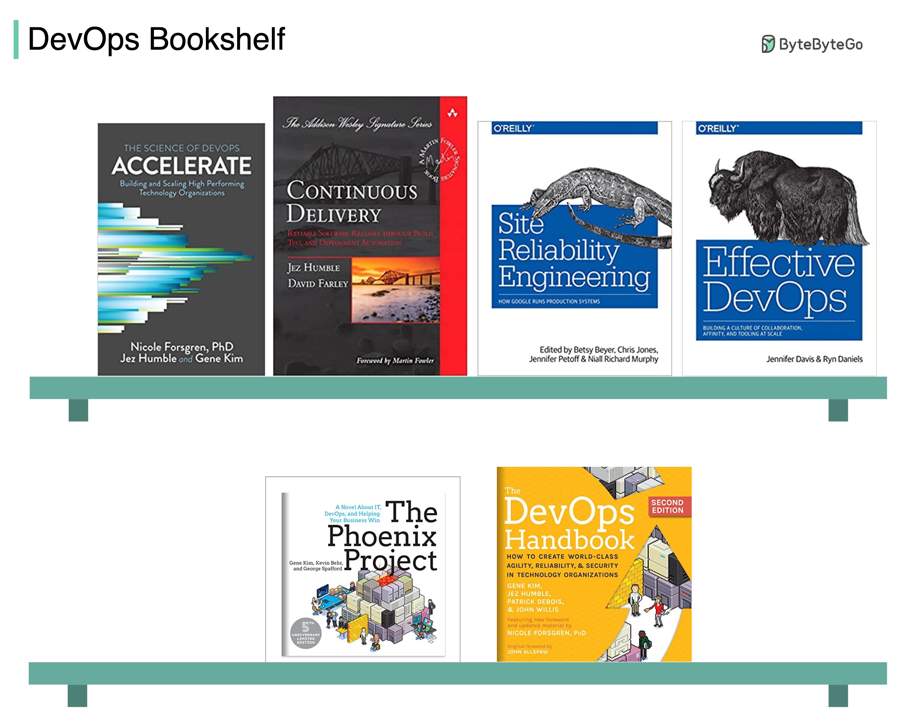

# 📚 6本DevOps好书推荐

> SRE、持续交付、团队协作……每本都是经典

想深入了解 DevOps？这6本书值得一读 👇

📌 **《Accelerate》** — 用科学方法衡量软件交付效能
📌 **《Continuous Delivery》** — 自动化架构管理和数据迁移的经典
📌 **《Site Reliability Engineering》** — Google SRE 圣经，覆盖开发、部署、监控全生命周期
📌 **《Effective DevOps》** — 提升团队协作的实用方法
📌 **《The Phoenix Project》** — 经典小说，IT工作就像制造业，需要建立流程。超有趣的一本
📌 **《The DevOps Handbook》** — 产品开发、质量保证、运维、信息安全全覆盖

💡 建议先读《The Phoenix Project》入门（小说好读），再读《Accelerate》和SRE那本深入。

你读过哪几本？👇

---

#DevOps #SRE #书单 #运维 #持续交付 #程序员 #技术书
