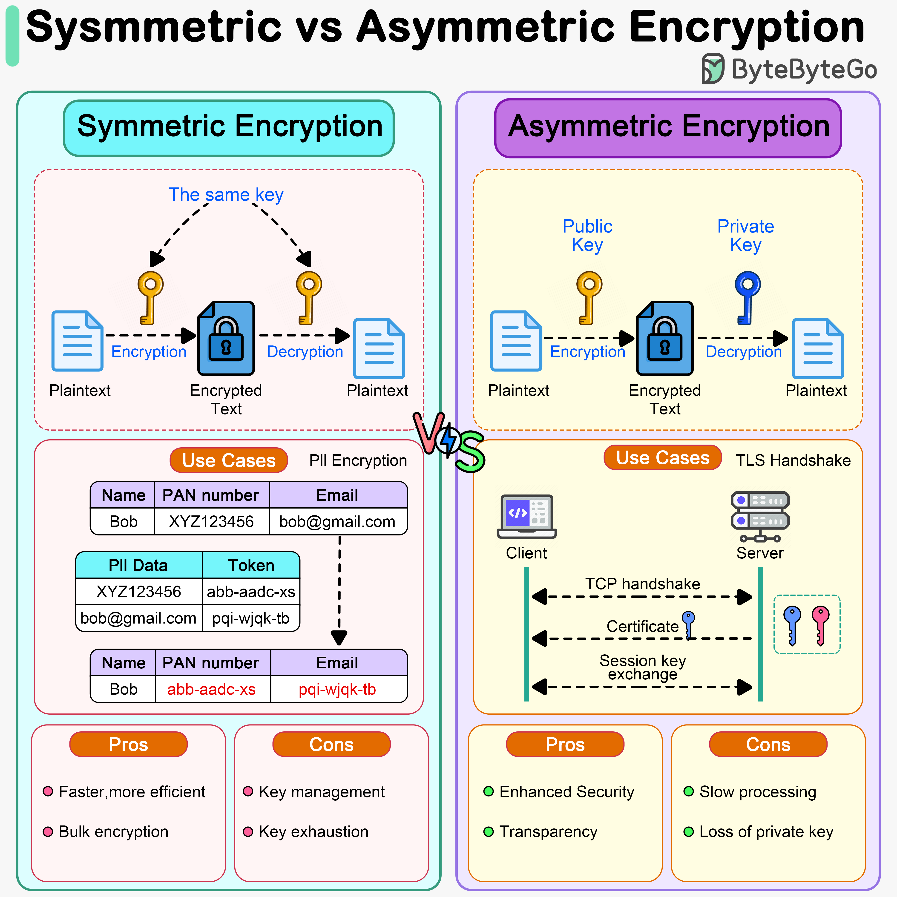

# 🔐 对称加密 vs 非对称加密

> HTTPS 其实两种都用了

加密分两种，各有优劣 👇

📌 **对称加密**
- 加密和解密用 **同一把密钥**
- 速度快，适合大量数据加密
- 比如加密海量PII（个人身份信息）数据
- ⚠️ 密钥管理是难题——发送方和接收方要共享同一把密钥

📌 **非对称加密**
- 用一对密钥：**公钥加密，私钥解密**
- 公钥可以公开分发，私钥保密
- 更安全，因为私钥永远不需要共享
- ⚠️ 速度慢，密钥生成和计算复杂

📌 **HTTPS 怎么用的？**
- TLS 握手阶段用 **非对称加密** 交换会话密钥
- 后续通信用 **对称加密**（因为快）
- 两者结合，既安全又高效 ✅

💡 简单记：对称 = 一把钥匙，快但不好分发；非对称 = 两把钥匙，安全但慢。

你能说出几种常见的加密算法？👇

---

#加密 #对称加密 #非对称加密 #HTTPS #安全 #面试 #程序员
