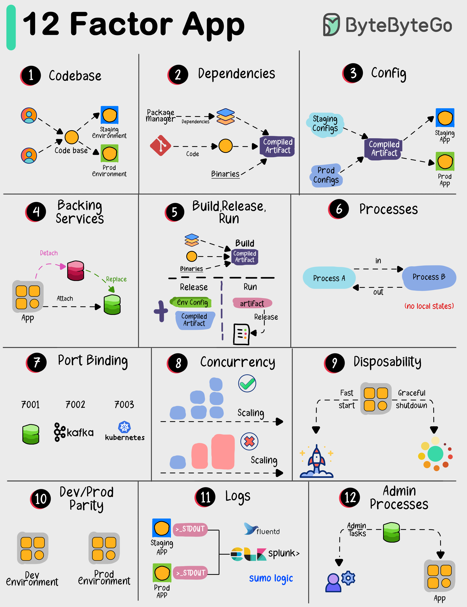

# 🏗️ 12-Factor App

> 云原生应用的最佳实践指南

想构建可靠、可扩展、易维护的现代应用？遵循这12条原则 👇

📌 **I. 代码库** — 一个代码库，用Git管理
📌 **II. 依赖** — 明确声明所有依赖
📌 **III. 配置** — 配置和代码分离（数据库密码等不要写死）
📌 **IV. 后端服务** — 数据库、支付等作为可插拔的外部服务
📌 **V. 构建/发布/运行** — 三个阶段严格分离
📌 **VI. 进程** — 无状态进程，像乐高积木一样可组合
📌 **VII. 端口绑定** — 通过端口暴露服务
📌 **VIII. 并发** — 通过增加进程副本来扩展
📌 **IX. 易处置** — 快速启动，优雅关闭
📌 **X. 开发/生产一致** — 开发环境和生产环境尽量一致
📌 **XI. 日志** — 把日志当作事件流
📌 **XII. 管理进程** — 管理任务和应用分开运行

💡 这12条原则是云原生应用的基石，Heroku 团队总结的经典。

你的项目遵循了几条？👇

---

#12Factor #云原生 #最佳实践 #架构 #DevOps #后端 #程序员
