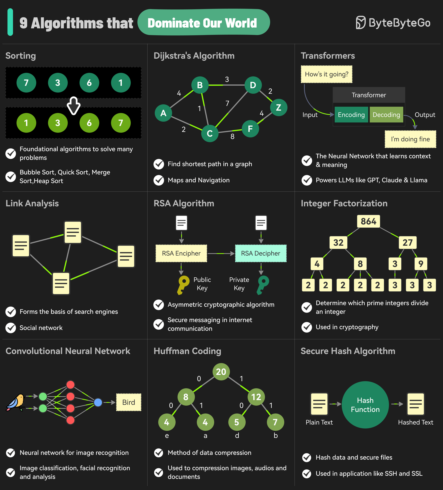

# 🧠 统治世界的9大算法！你每天都在用

> 搜索引擎、社交网络、WiFi、手机……背后都是它们

这9个算法渗透在我们日常生活的方方面面 👇

📌 **1. 排序算法** — 数据处理的基础
📌 **2. Dijkstra算法** — 最短路径，导航必备
📌 **3. Transformer** — ChatGPT等大模型的核心架构
📌 **4. 链接分析** — Google搜索排名的基础（PageRank）
📌 **5. RSA算法** — 互联网加密通信的基石
📌 **6. 整数分解** — 密码学的数学基础
📌 **7. 卷积神经网络（CNN）** — 图像识别、人脸识别
📌 **8. 霍夫曼编码** — 数据压缩（ZIP、JPEG）
📌 **9. 安全哈希算法（SHA）** — 数据完整性校验

💡 这些算法看似遥远，其实你每天打开手机、上网、拍照都在用。了解它们能让你对技术世界有更深的理解。

你最感兴趣的是哪个算法？👇

---

#算法 #计算机科学 #AI #加密 #程序员 #面试 #技术
