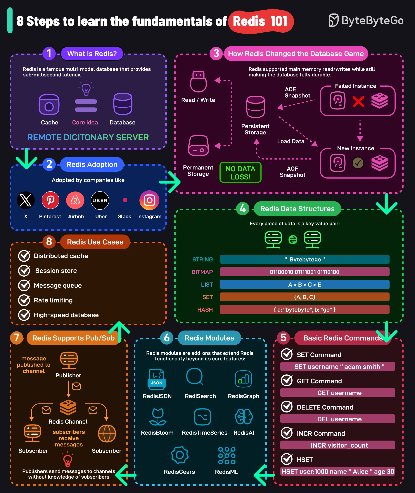

# 🔴 Redis入门8步走

> Airbnb、Uber、Slack都在用的亚毫秒级数据库

Redis 功能强大但入门不难，8步搞懂基础 👇

📌 **1. Redis是什么？**
Remote Dictionary Server，亚毫秒延迟的多模态数据库。核心理念：缓存也能当正经数据库用

📌 **2. 谁在用？**
Airbnb、Uber、Slack 等高流量网站

📌 **3. 怎么做到又快又持久？**
读写走内存，同时用 RDB快照 + AOF日志 持久化到磁盘

📌 **4. 数据结构**
String、Bitmap、List、Set、Sorted Set、Hash、JSON 等

📌 **5. 基本命令**
SET、GET、DELETE、INCR、HSET 等

📌 **6. 扩展模块**
RediSearch、RedisJSON、RedisGraph、RedisBloom、RedisAI 等

📌 **7. 发布订阅**
支持 Pub/Sub 事件驱动架构

📌 **8. 使用场景**
分布式缓存、Session存储、消息队列、限流、高速数据库

💡 Redis 是后端工程师的必备技能，建议从这8个概念入手。

你用 Redis 最多的场景是什么？👇

---

#Redis #缓存 #数据库 #后端 #系统设计 #面试 #程序员
