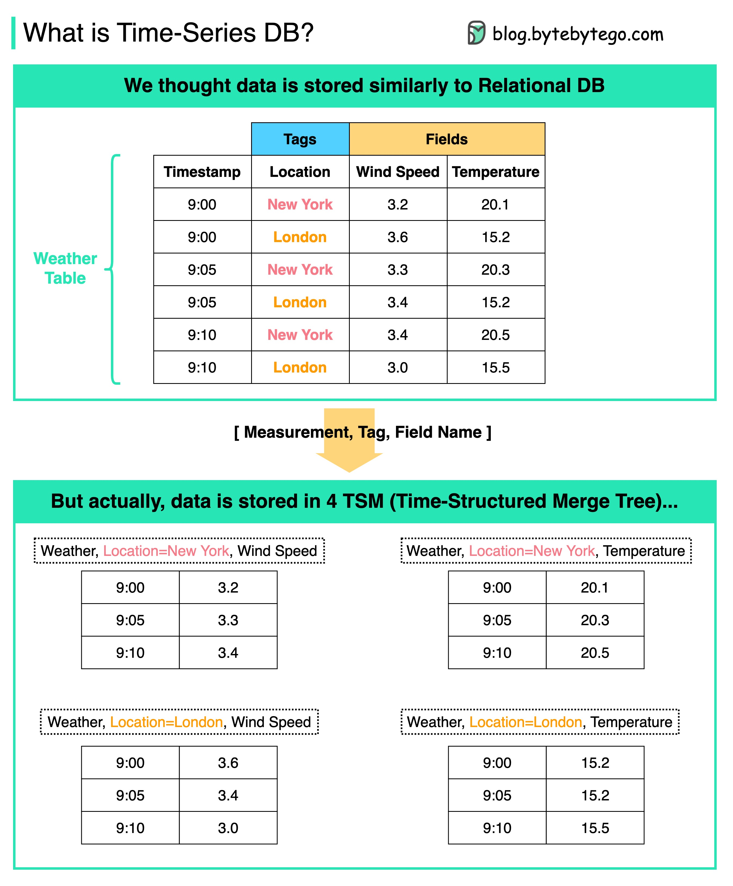

# ⏱️ 时序数据库TSDB是什么

> 20行搞懂时序数据库的内部数据模型

时序数据库专门为时间序列数据优化，和普通数据库有什么不同？👇

📌 **用户视角**
数据看起来和关系型数据库的表差不多

📌 **内部存储**
底层用 **TSM（Time-Structured Merge Tree）** 存储，格式为 [Measurement, Tag, Field Name]，能快速按时间和标签聚合分析

📌 **典型使用场景：**
- 📈 交易和行情数据
- 🖥️ 服务器监控指标
- 📊 应用性能监控（APM）
- 🌐 网络数据
- 🌡️ 传感器数据（IoT）
- 🖱️ 点击流分析
- 📋 事件记录

💡 如果你的数据天然带时间戳且需要按时间聚合查询，时序数据库比关系型数据库高效得多。常见的有 InfluxDB、TimescaleDB、Prometheus。

你用过时序数据库吗？👇

---

#时序数据库 #TSDB #监控 #数据库 #IoT #后端 #系统设计
