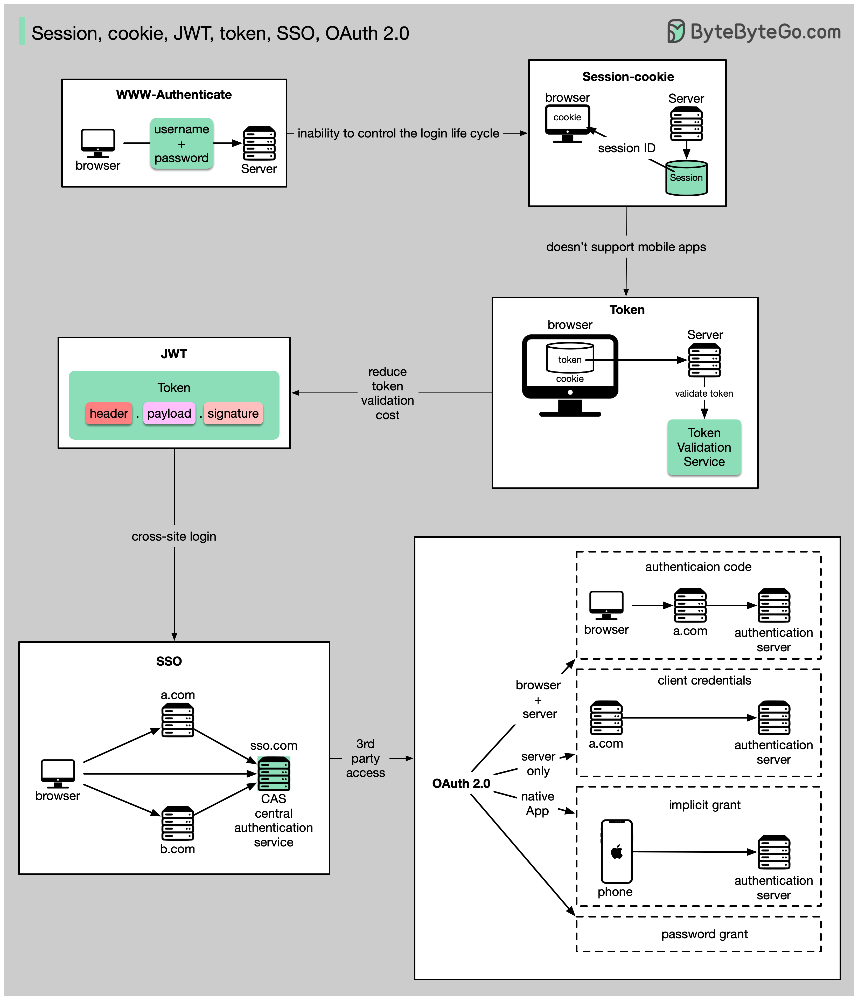

# 🔑 Token、Cookie、

> 从简单到复杂，用户身份管理的6种方案

登录网站时，你的身份是怎么被管理的？从简单到复杂 👇

📌 **WWW-Authenticate** — 最基础，浏览器弹窗输入用户名密码。无法控制登录生命周期，现在很少用

📌 **Session-Cookie** — 服务端存Session，浏览器存Session ID。可以精细控制登录周期，但对移动端不友好

📌 **Token** — 客户端发Token给服务端验证。解决了跨平台兼容问题，但需要加解密

📌 **JWT** — 标准化的Token方案，数字签名保证可信。服务端不用存Session信息

📌 **SSO（单点登录）** — 一次登录，多个网站通用。用CAS维护跨站信息

📌 **OAuth 2.0** — 授权一个网站访问你在另一个网站的信息

💡 从 WWW-Authenticate 到 OAuth 2.0，每种方案都是为了解决上一种的痛点。理解演进过程比死记硬背更重要。

你的项目用的哪种方案？👇

---

#认证 #JWT #Session #Cookie #OAuth #SSO #面试 #后端
