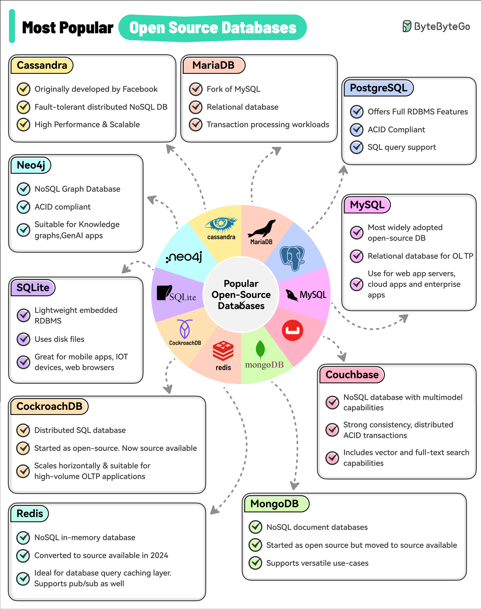

# 🏆 最受欢迎的10大开源数据库！

> 按采用率、行业影响力和开发者认知度排名

开源数据库这么多，哪些最受欢迎？👇

📌 **MySQL** — 最广泛使用的关系型数据库
📌 **PostgreSQL** — 功能最强大的开源关系型数据库
📌 **MariaDB** — MySQL的开源分支
📌 **Apache Cassandra** — 分布式宽列数据库
📌 **Neo4j** — 图数据库的代表
📌 **SQLite** — 嵌入式数据库，移动端首选
📌 **CockroachDB** — 分布式SQL数据库
📌 **Redis** — 内存KV数据库/缓存
📌 **MongoDB** — 文档数据库的代表
📌 **Couchbase** — 分布式NoSQL数据库

💡 没有最好的数据库，只有最适合场景的。关系型、文档型、图、KV……根据数据特征选。

你最常用的是哪个？👇

---

#数据库 #开源 #MySQL #PostgreSQL #Redis #MongoDB #后端
