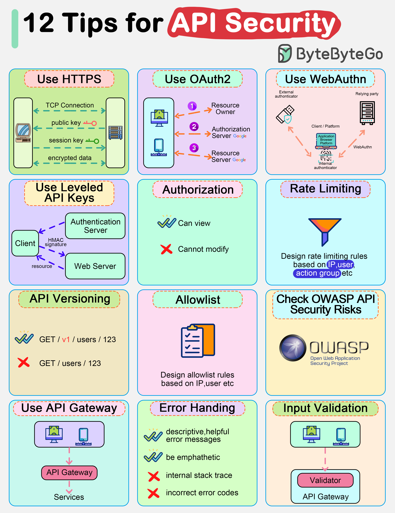

# 🔒 API安全12条军规！每条都不能忽视

> 从HTTPS到输入验证，API安全的完整清单

API 暴露在公网上，安全必须重视。12条核心建议 👇

📌 **HTTPS** — 加密传输，基本操作
📌 **OAuth2** — 标准化授权框架
📌 **WebAuthn** — 无密码认证
📌 **分级API Key** — 不同权限用不同Key
📌 **授权控制** — 确保用户只能访问自己的资源
📌 **限流** — 防止滥用和DDoS
📌 **API版本管理** — 平滑升级，不破坏现有客户端
📌 **白名单** — 只允许可信来源访问
📌 **OWASP API安全风险** — 对照检查常见漏洞
📌 **API网关** — 统一入口，集中管控
📌 **错误处理** — 不泄露内部信息
📌 **输入验证** — 永远不信任客户端输入

💡 API安全不是事后补救，而是设计阶段就要考虑的。这12条建议收藏备用。

你的API做了哪些安全措施？👇

---

#API安全 #HTTPS #OAuth #限流 #后端 #安全 #面试
