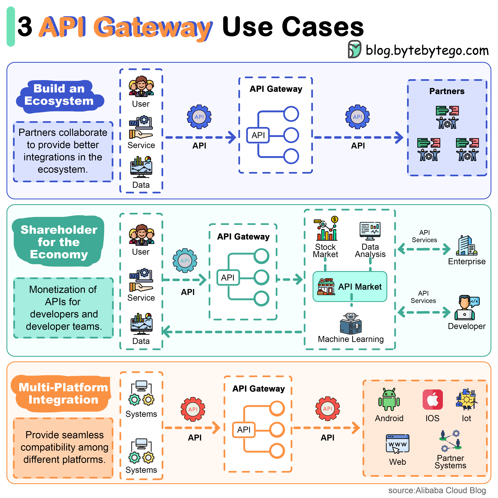

# 🚪 API网关的3大核心用途！

> 生态构建、API市场、多平台兼容

API网关位于客户端和服务之间，它能做什么？👇

📌 **构建生态系统**
用户通过API网关访问更广泛的工具集，生态伙伴协作提供更好的集成

📌 **构建API市场**
API市场托管基础功能，开发者和企业可以在生态中创新，并在市场上销售API

📌 **多平台兼容**
面对多个复杂架构时，API网关帮助跨平台协作

💡 API网关是微服务架构的标配，不只是路由转发，更是生态和商业模式的基础。

你们用的什么API网关？Kong？Nginx？AWS API Gateway？👇

---

#API网关 #微服务 #架构 #后端 #系统设计 #Kong #面试
