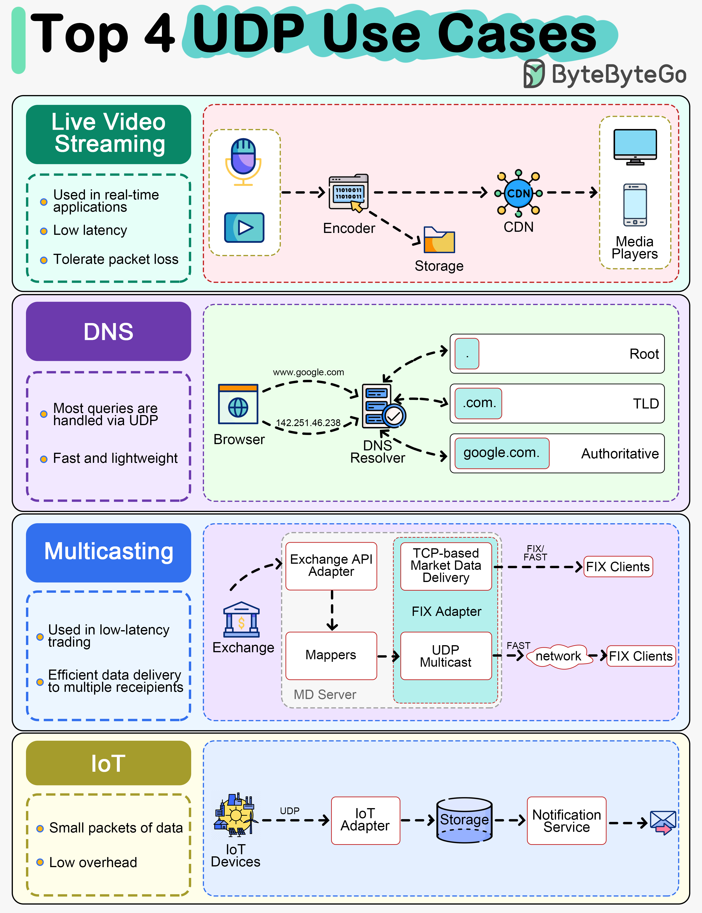

# 📡 UDP的4大使用场景

> 直播、DNS、行情推送、IoT都在用UDP

UDP 虽然不保证可靠传输，但在这些场景下比TCP更合适 👇

📌 **视频直播/视频会议**
VoIP 和视频会议利用 UDP 的低开销和容忍丢包特性，延迟比TCP低得多

📌 **DNS查询**
DNS 查询通常用 UDP，快速轻量。大响应或区域传输才用TCP

📌 **行情数据组播**
低延迟交易中，UDP 用于高效地同时向多个接收方推送行情数据

📌 **IoT设备通信**
IoT 设备间发送小数据包，UDP 的低开销非常适合

💡 UDP 的核心优势：简单、快速、低开销。在能容忍少量丢包的实时场景下，UDP 是首选。

你在项目中用过 UDP 吗？👇

---

#UDP #网络协议 #直播 #DNS #IoT #后端 #面试
