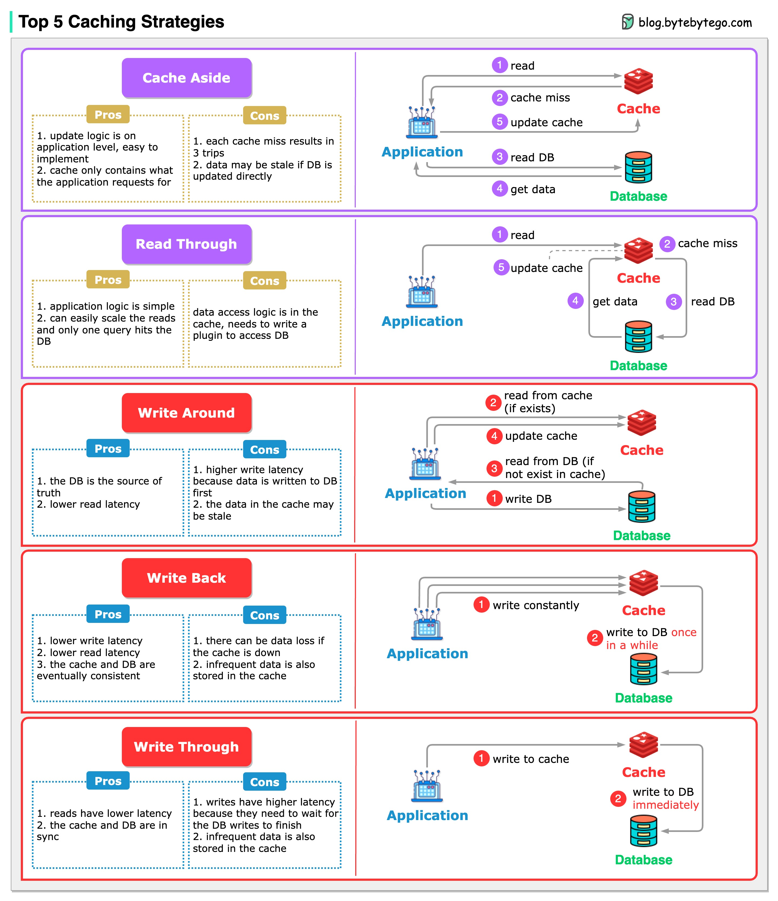

# 💾 5种缓存策略详解

> 读策略+写策略，组合使用效果更好

引入缓存后，缓存和数据库的数据同步是必须解决的问题。5种常用策略 👇

📌 **读策略：**
- **Cache Aside** — 先查缓存，没有再查数据库并回填缓存
- **Read Through** — 缓存层自动从数据库加载数据

📌 **写策略：**
- **Write Around** — 直接写数据库，绕过缓存
- **Write Back** — 先写缓存，异步写数据库（快但有丢数据风险）
- **Write Through** — 同时写缓存和数据库（一致性好但慢）

💡 这些策略通常组合使用。比如 Write Around + Cache Aside 是最常见的组合，确保缓存数据是最新的。

你的项目用的哪种缓存策略？👇

---

#缓存 #Redis #缓存策略 #系统设计 #后端 #性能优化 #面试
