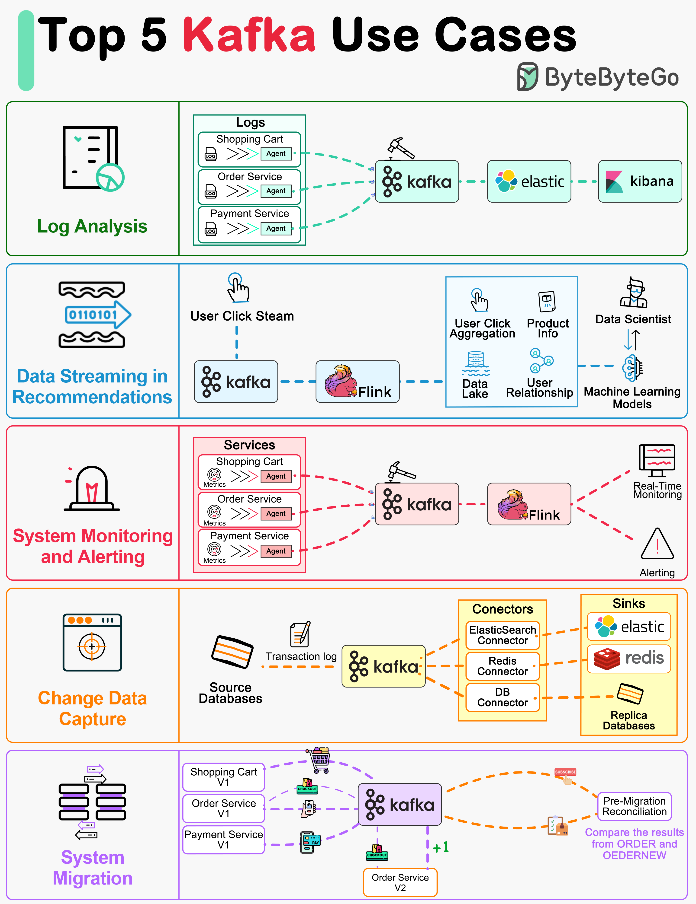

# 📨 Kafka的5大使用场景

> 日志处理、推荐系统、监控、CDC、系统迁移

Kafka 最初为海量日志处理而生，现在用途远不止于此 👇

📌 **日志处理与分析** — Kafka 的老本行，收集和处理海量日志
📌 **推荐系统数据流** — 实时流式处理用户行为数据，驱动推荐引擎
📌 **系统监控与告警** — 收集监控指标，实时触发告警
📌 **CDC（变更数据捕获）** — 捕获数据库变更，同步到其他系统
📌 **系统迁移** — 作为中间层，平滑地将数据从旧系统迁移到新系统

💡 Kafka 的核心特点：消息保留到过期、消费者按自己的节奏拉取。这让它在这些场景下特别好用。

你用 Kafka 做过什么？👇

---

#Kafka #消息队列 #数据流 #CDC #后端 #系统设计 #架构
