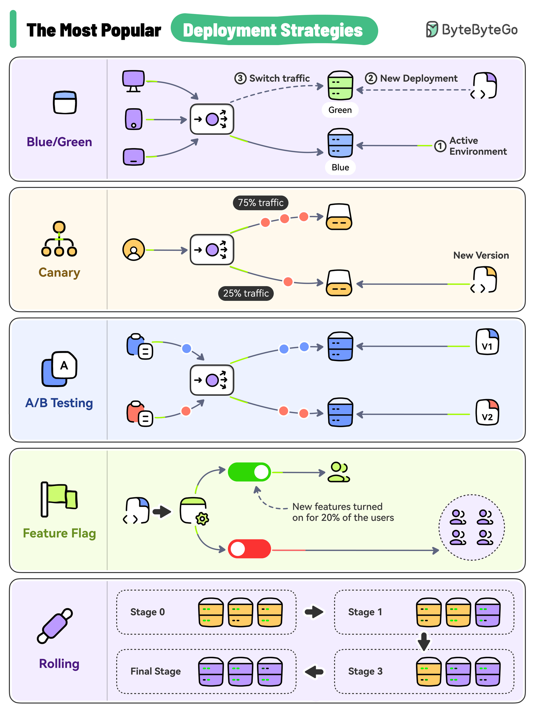

# 🚀 5种最常用的部署策略！上线不翻车

> 大爆炸、滚动、蓝绿、金丝雀、功能开关

代码写完了怎么上线？5种主流部署策略 👇

📌 **Big Bang（大爆炸）** — 一次性全量替换，简单粗暴，有停机风险
📌 **Rolling（滚动部署）** — 逐步替换实例，零停机
📌 **Blue-Green（蓝绿部署）** — 两套环境，一键切流量，可快速回滚
📌 **Canary（金丝雀发布）** — 先让一小部分用户用新版本，验证后再全量
📌 **Feature Toggle（功能开关）** — 代码已部署但功能默认关闭，按需开启

💡 风险从高到低：Big Bang > Rolling > Blue-Green > Canary > Feature Toggle。根据业务重要性选择合适的策略。

你们上线用的哪种策略？👇

---

#部署策略 #蓝绿部署 #金丝雀 #DevOps #CI/CD #运维 #后端
