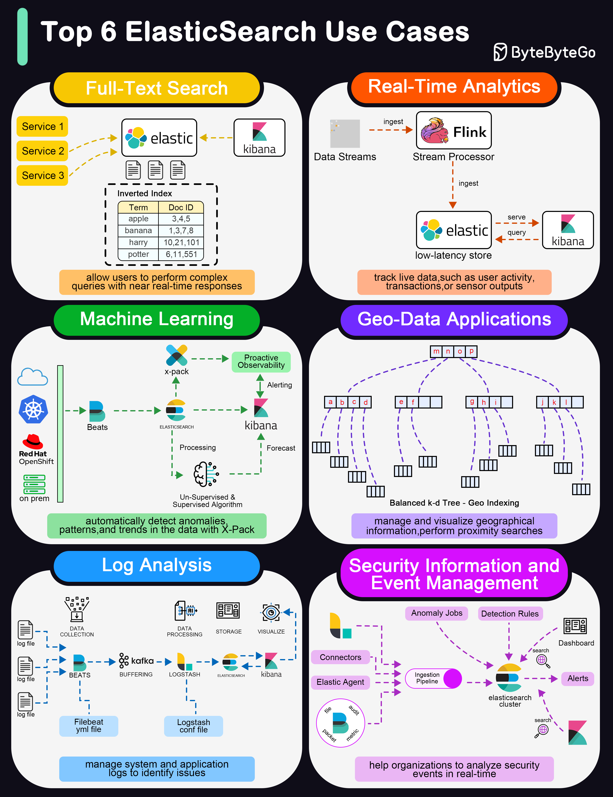

# 🔍 Elasticsearch的6大使用

> 全文搜索、实时分析、机器学习、地理数据……

Elasticsearch 的能力远不止全文搜索 👇

📌 **全文搜索** — ES的看家本领，复杂查询近实时响应
📌 **实时分析** — 实时仪表盘，追踪用户活动、交易、传感器数据
📌 **机器学习** — X-Pack ML功能，自动检测异常、模式和趋势
📌 **地理数据** — 地理空间索引和搜索，地图和位置服务
📌 **日志分析** — ELK Stack 的核心，聚合监控和分析日志
📌 **SIEM安全分析** — 实时分析安全事件

💡 ELK Stack（Elasticsearch + Logstash + Kibana）是日志分析的事实标准。

你用 ES 做过什么？👇

---

#Elasticsearch #搜索 #ELK #日志分析 #后端 #大数据 #运维
