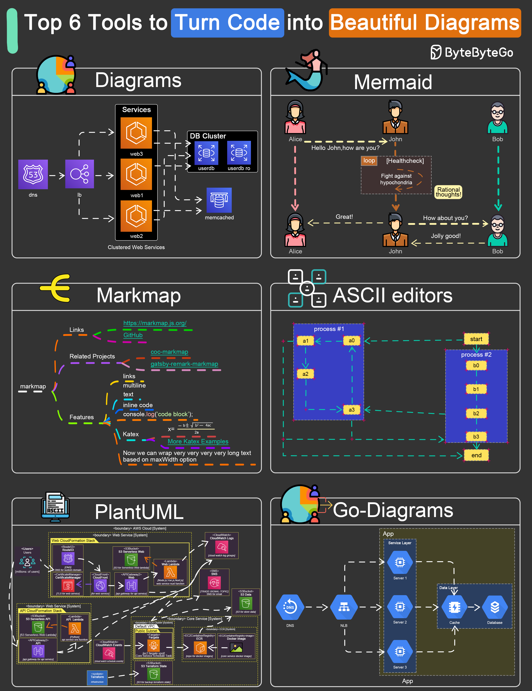

# 🎨 6个用代码画图的神器

> 写代码就能生成漂亮的架构图

不想拖拽画图？用代码生成图表更高效 👇

📌 **Diagrams** — Python写代码生成云架构图
📌 **Go Diagrams** — Go语言版本的架构图生成
📌 **Mermaid** — Markdown风格语法，GitHub原生支持
📌 **PlantUML** — 经典的UML图生成工具
📌 **ASCII Diagrams** — 纯文本画图，终端友好
📌 **Markmap** — 把Markdown转成思维导图

💡 推荐 Mermaid，语法简单，GitHub/Notion 都原生支持，写文档时直接嵌入。

你最喜欢用哪个画图工具？👇

---

#画图工具 #Mermaid #PlantUML #程序员 #效率 #开发工具 #文档
