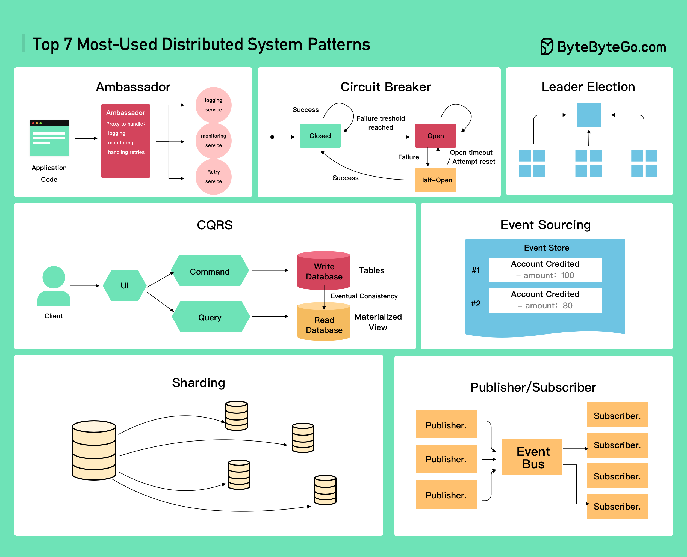

# 🌐 7种最常用的分布式系统模式！

> Ambassador、熔断器、CQRS、事件溯源……

分布式系统设计的7种核心模式 👇

📌 **Ambassador** — 代理模式，处理跨服务通信的通用功能
📌 **Circuit Breaker** — 熔断器，故障达到阈值后断开防止雪崩
📌 **CQRS** — 读写分离，查询和命令用不同模型
📌 **Event Sourcing** — 事件溯源，存储状态变更事件而非最终状态
📌 **Leader Election** — 领导者选举，分布式协调的基础
📌 **Publisher/Subscriber** — 发布订阅，解耦生产者和消费者
📌 **Sharding** — 分片，水平拆分数据到多个节点

💡 这7种模式是分布式系统的基石，面试系统设计题几乎都会涉及。

你最熟悉哪种模式？👇

---

#分布式系统 #设计模式 #CQRS #熔断器 #系统设计 #后端 #面试
