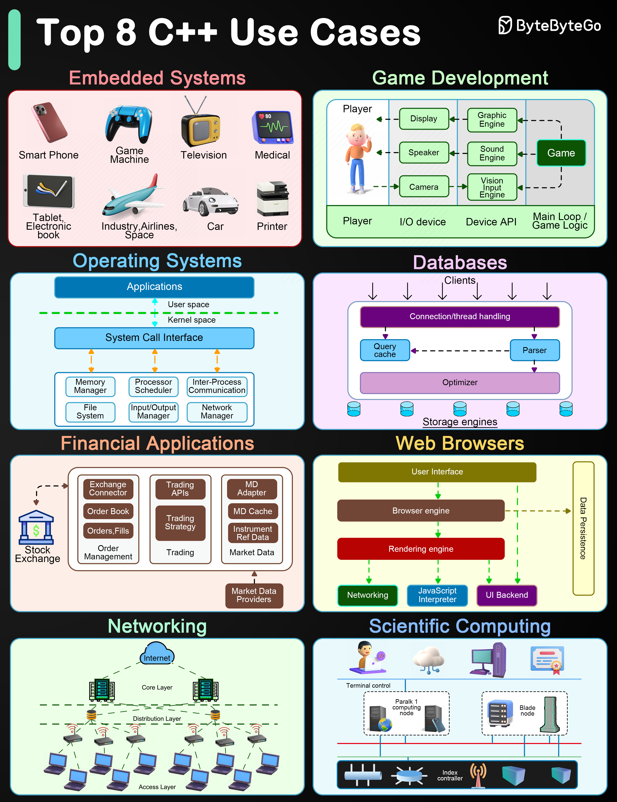

# ⚙️ C++的8大使用场景

> 嵌入式、游戏、操作系统、数据库……

C++ 已经40多岁了，但在这些领域依然不可替代 👇

📌 **嵌入式系统** — 高效+精细的硬件控制
📌 **游戏开发** — 性能和效率是游戏行业的刚需
📌 **操作系统** — 对系统资源和内存的极致控制
📌 **数据库** — 高性能数据库系统的首选实现语言
📌 **金融应用** — 低延迟交易系统
📌 **浏览器** — 渲染引擎等核心组件
📌 **网络** — 网络设备和仿真工具
📌 **科学计算** — 高性能+精确控制计算资源

💡 C++ 的核心优势就两个字：性能。在对性能有极致要求的场景下，它依然是王者。

你写过 C++ 吗？👇

---

#C++ #编程语言 #游戏开发 #嵌入式 #操作系统 #程序员 #面试
