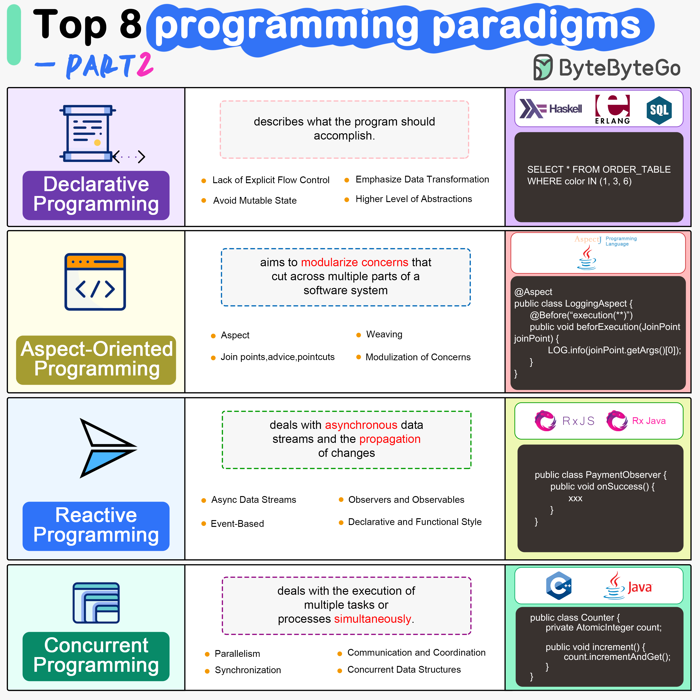

# 🧩 8大编程范式一图看懂！

> 命令式、声明式、OOP、函数式、响应式……

编程不只有面向对象，8种范式各有哲学 👇

📌 **命令式** — 一步步告诉计算机怎么做（C、Java、Python）
📌 **声明式** — 只描述要什么，不描述怎么做
📌 **面向对象（OOP）** — 用对象封装数据和行为（Java、C++、Python）
📌 **面向切面（AOP）** — 模块化横切关注点（AspectJ）
📌 **函数式** — 纯函数+不可变数据（Haskell、Scala、JS）
📌 **响应式** — 处理异步数据流和变化传播
📌 **泛型** — 类型无关的可复用代码
📌 **并发** — 多任务同时执行，提升性能

💡 现代语言大多支持多种范式。Python 既能命令式也能函数式，Java 既能OOP也能函数式。关键是选对场景。

你最喜欢哪种编程范式？👇

---

#编程范式 #函数式 #OOP #编程 #软件开发 #程序员 #面试
