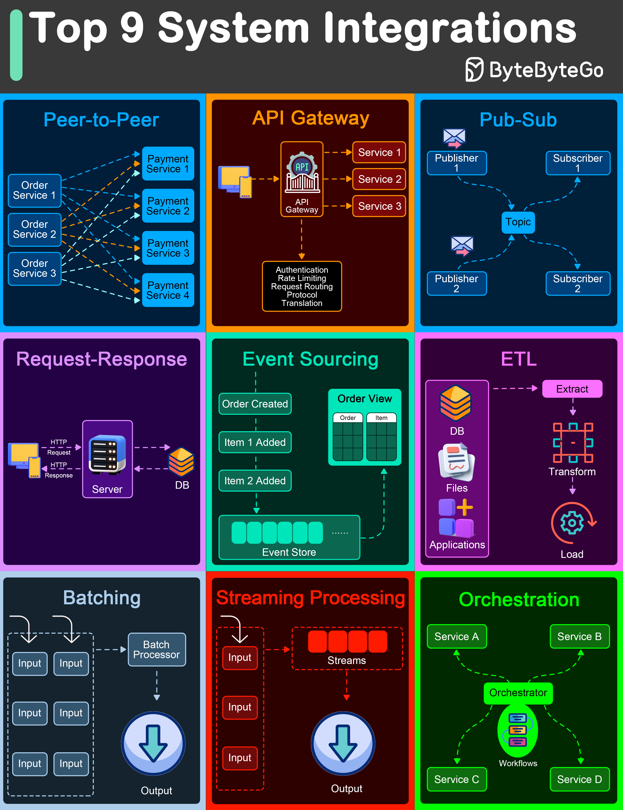

# 🔀 9种数据和通信流架构模式！

> P2P、API网关、发布订阅、ETL、流处理……

系统间数据怎么流转？9种核心架构模式 👇

📌 **P2P** — 点对点直接通信，无需中心协调
📌 **API Gateway** — 所有客户端请求的统一入口
📌 **Pub-Sub** — 发布订阅，通过消息代理解耦生产者和消费者
📌 **Request-Response** — 最基础的请求响应模式
📌 **Event Sourcing** — 存储状态变更事件序列
📌 **ETL** — 从多源提取、转换、加载到目标数据库
📌 **Batching** — 累积数据后批量处理
📌 **Streaming** — 实时连续处理数据流
📌 **Orchestration** — 中心编排器协调分布式组件

💡 这些模式经常组合使用。比如 API Gateway + Pub-Sub + Event Sourcing 是微服务架构的经典组合。

你的系统用了哪几种模式？👇

---

#架构模式 #系统设计 #ETL #流处理 #微服务 #后端 #面试
