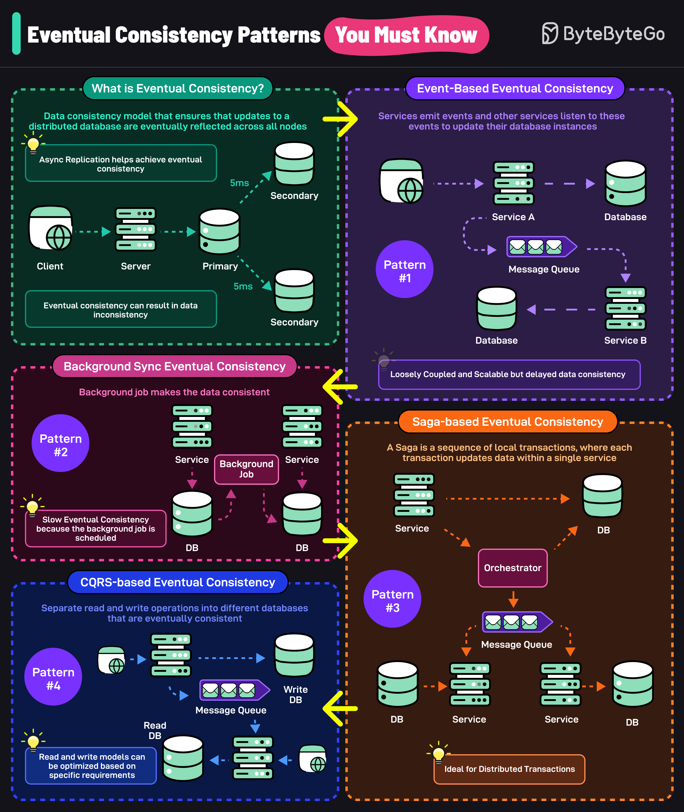

# 🔄 4种最终一致性模式！分布式数据库必知

> 事件驱动、后台同步、Saga、CQRS

最终一致性确保分布式数据库的更新最终会同步到所有节点。但也可能导致数据不一致，4种模式帮你应对 👇

📌 **事件驱动最终一致性** — 服务发出事件，其他服务监听并更新自己的数据库。松耦合但有延迟

📌 **后台同步最终一致性** — 后台任务定期同步数据。一致性更慢，取决于调度频率

📌 **Saga最终一致性** — 一系列本地事务，每个事务更新一个服务的数据。管理长事务的利器

📌 **CQRS最终一致性** — 读写分离到不同数据库，最终保持一致。读写模型可以各自优化

💡 最终一致性是分布式系统的常态，关键是选对模式并做好补偿机制。

你的项目用的哪种一致性模式？👇

---

#最终一致性 #分布式 #Saga #CQRS #系统设计 #后端 #面试
