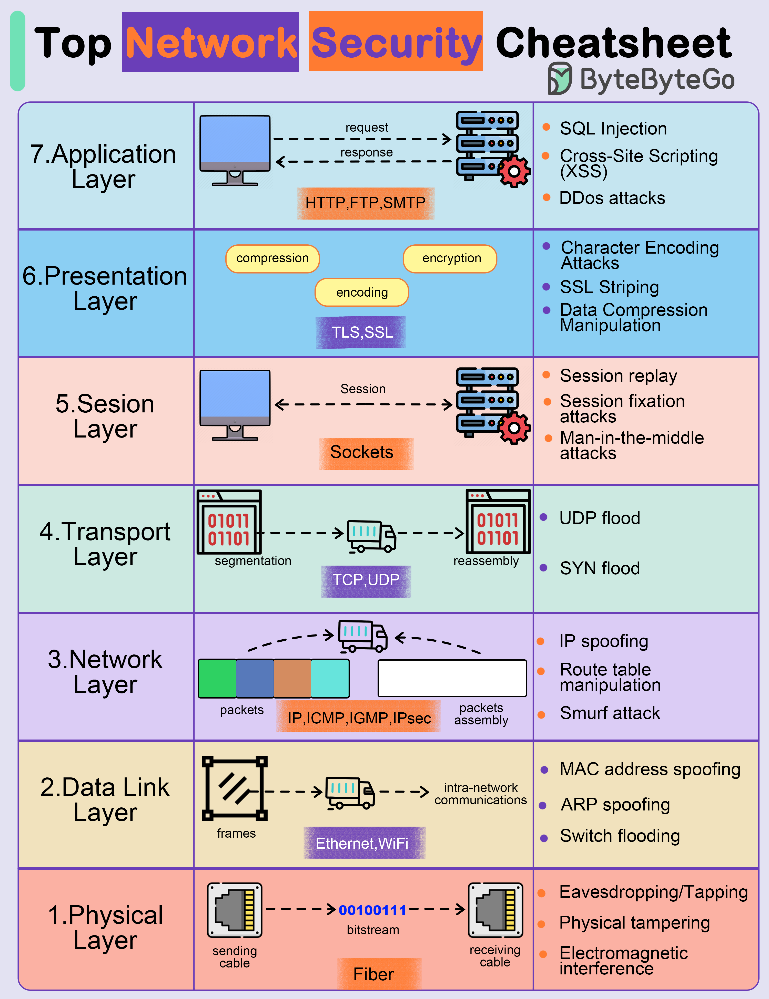

# 🛡️ 网络安全速查表

> 从物理层到应用层，每层都有安全威胁

OSI 七层模型每一层都可能被攻击 👇

📌 **应用层** — 钓鱼、恶意软件注入、DDoS
📌 **表示层** — 编解码漏洞、格式化字符串攻击、恶意代码注入
📌 **会话层** — 会话劫持、会话固定、暴力破解
📌 **传输层** — 中间人攻击、SYN/ACK洪泛
📌 **网络层** — IP欺骗、路由表篡改、DDoS
📌 **数据链路层** — MAC地址欺骗、ARP欺骗、VLAN跳跃
📌 **物理层** — 窃听、物理篡改、电磁干扰

💡 安全防护要分层考虑，每一层都需要对应的防护措施。收藏这张图，做安全评估时参考。

你最关注哪一层的安全？👇

---

#网络安全 #OSI #安全 #DDoS #中间人攻击 #运维 #面试
