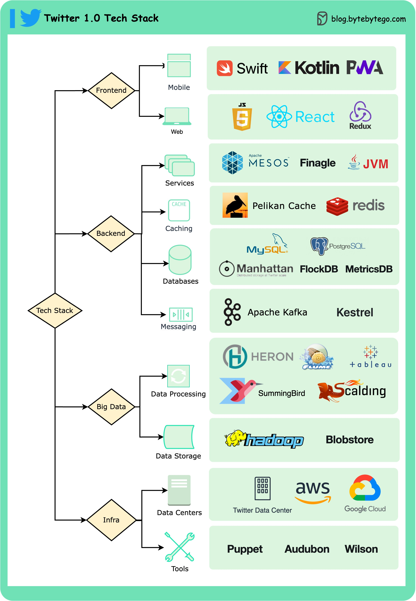

# 🐦 Twitter 1.0 技术栈揭秘！

> 移动端、Web端、服务层、缓存、数据库

Twitter 1.0 的技术栈长什么样？👇

📌 **移动端** — Swift（iOS）、Kotlin（Android）、PWA
📌 **Web端** — JavaScript、React、Redux
📌 **服务层** — Mesos（容器编排）、Finagle（RPC框架）
📌 **缓存** — Pelikan Cache、Redis
📌 **数据库** — Manhattan（自研分布式KV）、MySQL、PostgreSQL

💡 Twitter 的技术栈特点：自研组件多（Manhattan、Pelikan），服务层用 Scala 生态（Finagle）。

你对 Twitter 的哪个技术选型最感兴趣？👇

---

#Twitter #技术栈 #React #Redis #架构 #后端 #程序员
