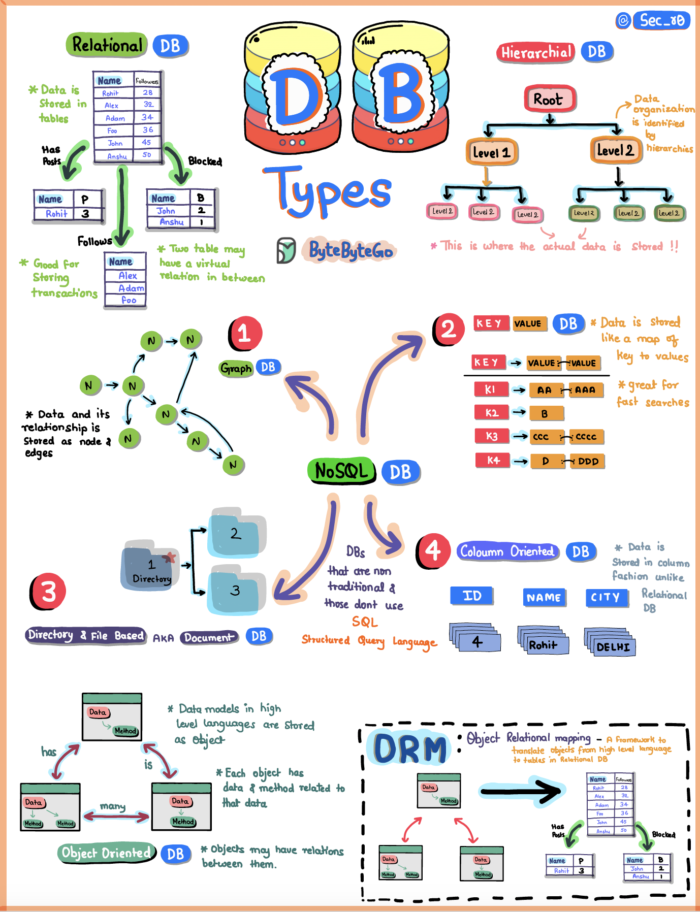

# 🗄️ 数据库有哪些类型

> 不同数据库解决不同问题，别只知道MySQL

数据库不只有关系型，来看看主要类型 👇

📌 **关系型数据库（Relational DB）**
数据整齐地存在表里，行列分明。MySQL、PostgreSQL 就是代表

📌 **OLAP数据库**
专为报表和分析优化，处理海量数据的聚合查询

📌 **NoSQL数据库** — 四种风格：
- 🕸️ **图数据库** — 关注实体间的关系，社交网络首选
- 🔑 **KV存储** — 每条数据有唯一Key，查找极快
- 📄 **文档数据库** — 类JSON格式存储，灵活无Schema
- 📊 **列式数据库** — 按列存储，分析查询效率高

💡 选数据库的关键：看你的数据长什么样、怎么查询、一致性要求多高。

你最常用的是哪种数据库？👇

---

#数据库 #MySQL #MongoDB #Redis #NoSQL #后端 #面试
