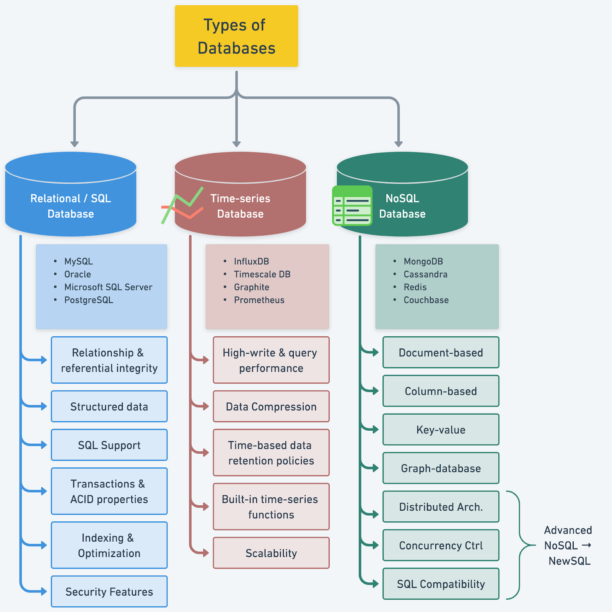

# 📚 数据库类型全解析！选型前必看

> 了解不同数据库的特点和使用场景

做项目选数据库，首先要了解市面上有哪些类型 👇

📌 每种数据库都有自己的关键特征和适用场景
📌 了解不同类型的数据库，才能为项目做出最佳选择
📌 关键是对比它们的使用场景，而不是盲目跟风

💡 没有万能的数据库，关键是匹配你的数据特征、查询模式和一致性要求。收藏这张对比图，选型时参考。

你在选数据库时最看重什么？👇

---

#数据库 #选型 #MySQL #MongoDB #Redis #后端 #系统设计
