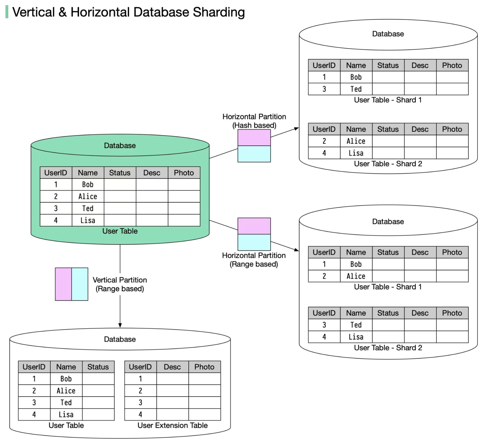

# 📊 垂直分区 vs 水平分区

> 一个拆列，一个拆行，各有优劣

大规模应用中数据需要分区，两种策略 👇

📌 **垂直分区**
把某些列移到新表，每个表行数相同但列更少

📌 **水平分区（分片/Sharding）**
把表拆成多个小表，每个表列相同但行更少

📌 **路由算法：**
- **范围分片** — 按有序列（ID、时间戳）分，如ID 1-2在分片1，3-4在分片2
- **哈希分片** — 对列做哈希运算，如 UserID mod 2

📌 **优势：**
- 支持水平扩展，加机器分散负载
- 查询更少的行，响应更快

📌 **劣势：**
- 排序操作更复杂，需要跨分片取数据再排序
- 数据分布可能不均匀（热点问题）

💡 水平分区是大规模系统的标配，但要注意热点问题和跨分片查询的复杂度。

你的项目做了分区吗？👇

---

#分区 #分片 #Sharding #数据库 #系统设计 #后端 #面试
