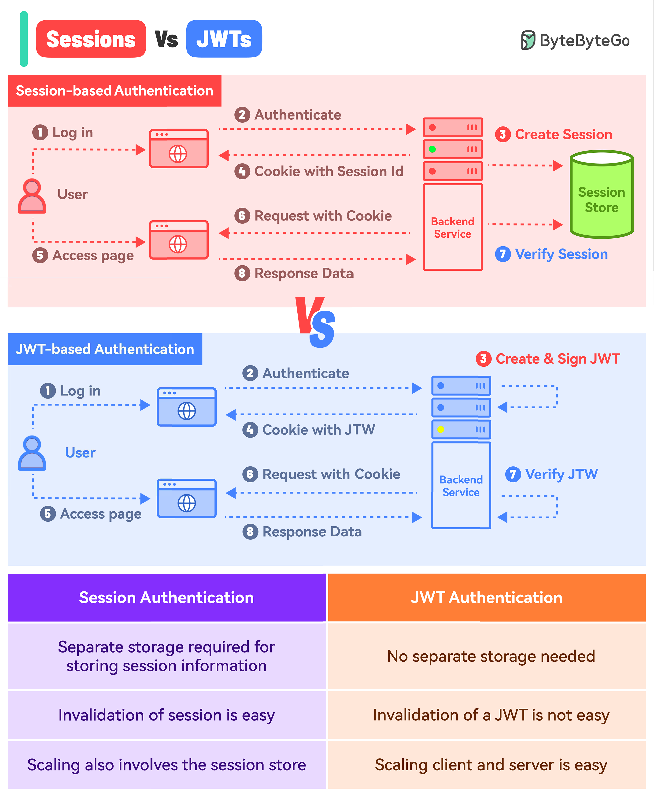

# 🔑 Session认证 vs JWT认证

> 一个像只给你票号，一个像给你完整机票

两种最主流的认证方式，用机票来比喻 👇

📌 **Session认证 = 只给票号**
- 登录后服务端创建Session，存在数据库/Session Store
- 返回Session ID给客户端（Cookie）
- 每次请求带上Session ID，服务端查库验证
- 所有信息存服务端

📌 **JWT认证 = 给完整机票**
- 登录后服务端签发JWT（用私钥签名）
- 不需要Session存储
- JWT包含所有用户信息（编码后）
- 每次请求带上JWT，服务端用私钥验证

📌 **怎么选？**
- 需要服务端控制（如强制下线）→ Session
- 无状态、微服务架构 → JWT
- 安全性要求高 → Session（可以随时失效）
- 扩展性要求高 → JWT（不依赖Session Store）

你的项目用的哪种？👇

---

#Session #JWT #认证 #安全 #后端 #面试 #程序员
