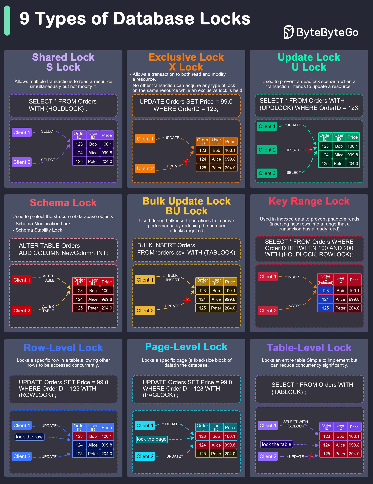

# 🔐 9种数据库锁详解！并发控制的基础

> 共享锁、排他锁、行锁、表锁……

数据库锁防止并发访问导致数据不一致，9种常见类型 👇

📌 **共享锁（S Lock）** — 多个事务可同时读，但不能改
📌 **排他锁（X Lock）** — 独占读写，其他事务不能加任何锁
📌 **更新锁（U Lock）** — 防止更新时的死锁
📌 **Schema锁** — 保护数据库对象结构
📌 **批量更新锁（BU Lock）** — 批量插入时减少锁数量提升性能
📌 **键范围锁** — 防止幻读（在已读范围内插入新行）
📌 **行级锁** — 锁定特定行，其他行可并发访问
📌 **页级锁** — 锁定一个数据页
📌 **表级锁** — 锁整张表，简单但并发度低

💡 锁粒度越细并发度越高但开销越大。行级锁是最常用的平衡点。

你遇到过死锁吗？怎么解决的？👇

---

#数据库锁 #并发控制 #MySQL #事务 #后端 #面试 #程序员
