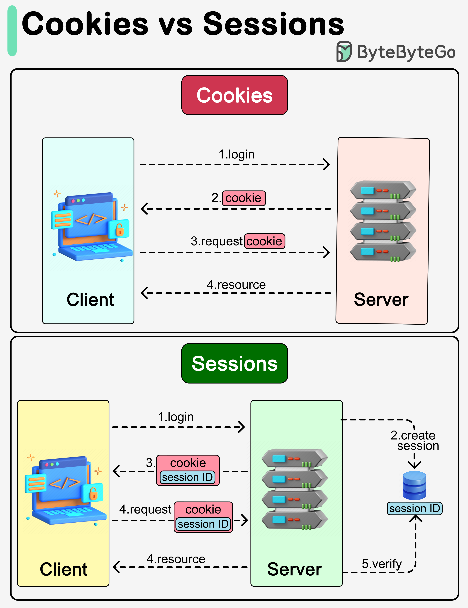

# 🍪 Cookie vs Session

> 都用来携带用户信息，但机制完全不同

Cookie 和 Session 都用来在HTTP请求中携带用户信息，但区别很大 👇

📌 **Cookie**
- 存在用户设备上（客户端）
- 大小限制 4KB
- 每次请求自动发送
- 用户可以在浏览器中禁用

📌 **Session**
- 创建并存储在服务端
- 生成唯一Session ID，通过Cookie返回给客户端
- 可以存储更大量的数据
- 客户端不能直接访问Session数据，更安全

💡 简单记：Cookie 是客户端的小纸条，Session 是服务端的档案。Session ID 通过 Cookie 传递。

你更倾向用哪种方案？👇

---

#Cookie #Session #Web开发 #安全 #后端 #面试 #程序员
