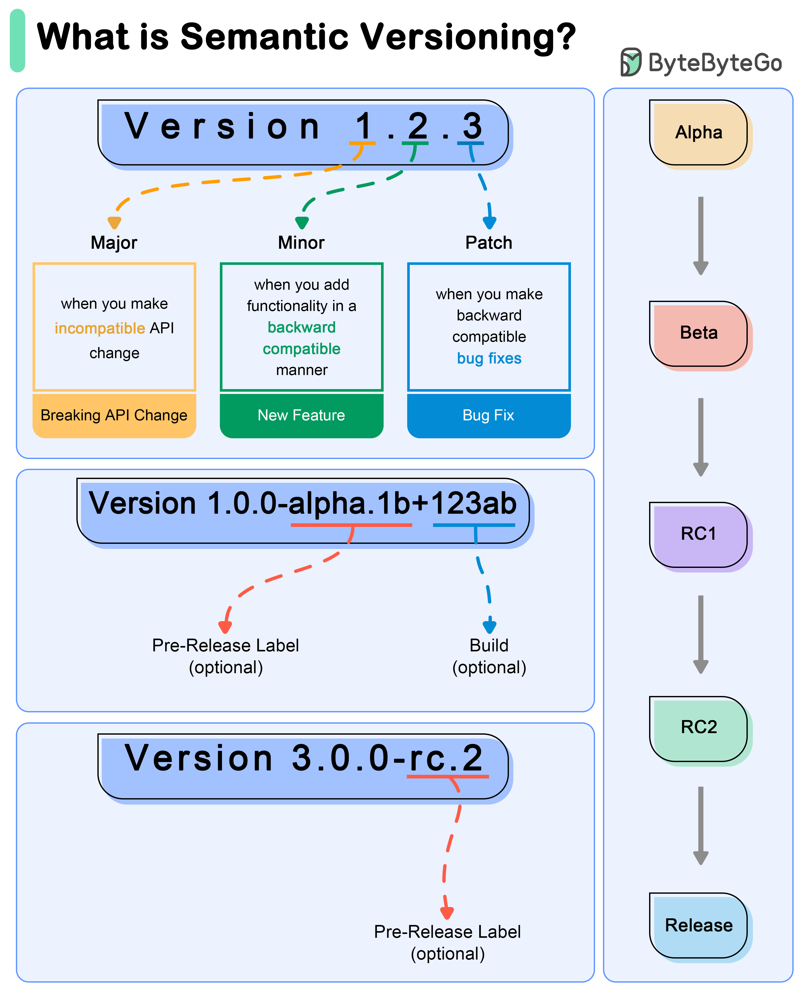

# 🔢 版本号是什么意思？语义化版本详解

> MAJOR.MINOR.PATCH，每个数字都有含义

软件版本号不是随便写的，语义化版本（SemVer）有明确规则 👇

📌 **格式：MAJOR.MINOR.PATCH**
- **MAJOR** — 不兼容的API变更（破坏性更新）
- **MINOR** — 向后兼容的新功能
- **PATCH** — 向后兼容的Bug修复

📌 **示例流程：**
- 0.1.0 → 开发阶段
- 1.0.0 → 第一个稳定版
- 1.0.1 → Bug修复
- 1.1.0 → 新功能
- 2.0.0 → 破坏性变更

📌 **特殊版本：**
- 预发布：1.0.0-alpha、1.0.0-beta、1.0.0-rc.1
- 构建元数据：1.0.0+20130313144700

💡 遵循 SemVer 能让使用者快速判断升级风险。MAJOR 变了要小心，PATCH 变了放心升。

你的项目遵循语义化版本吗？👇

---

#版本号 #SemVer #软件工程 #API #开发 #程序员 #面试
