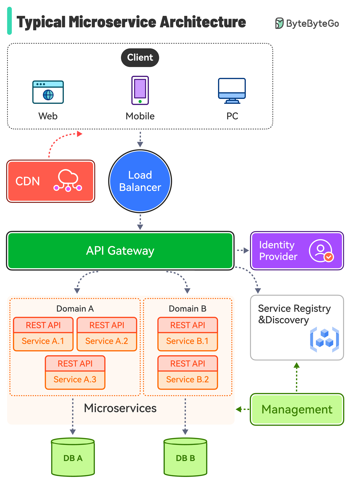

# 🏗️ 典型的微服务架构长什么样？

> 负载均衡、CDN、API网关、服务发现……全覆盖

一个典型的微服务架构包含这些核心组件 👇

📌 **负载均衡器** — 分发流量到多个后端服务
📌 **CDN** — 静态内容就近分发，客户端优先从CDN获取
📌 **API网关** — 统一入口，路由请求到对应服务，对接身份认证和服务发现
📌 **身份提供者** — 处理用户认证和授权
📌 **服务注册与发现** — 微服务注册自己，API网关通过它找到目标服务
📌 **管理组件** — 监控所有服务的状态
📌 **微服务** — 按业务域设计和部署，每个域有自己的数据库

💡 这张图是微服务架构的标准模板，面试系统设计题画出这个框架就成功了一半。

你的微服务架构和这个有什么不同？👇

---

#微服务 #架构 #API网关 #服务发现 #系统设计 #后端 #面试
