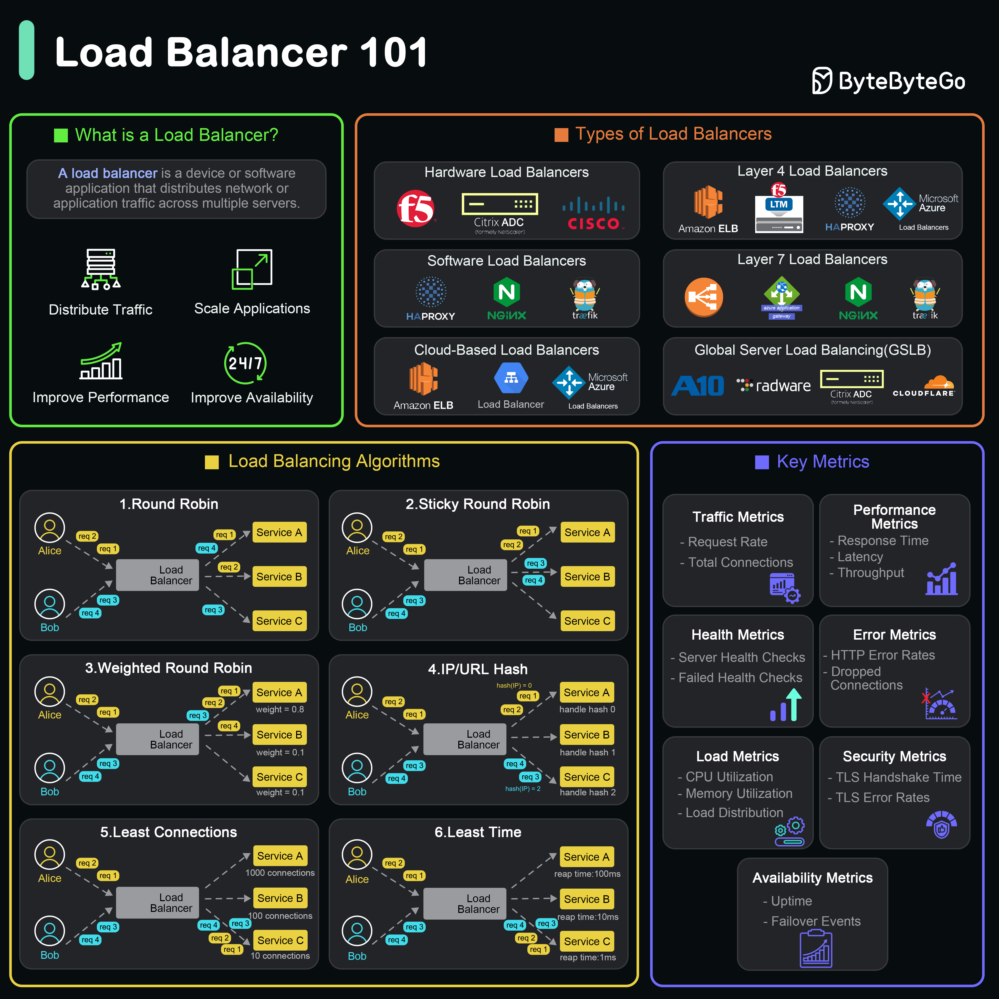

# ⚖️ 什么是负载均衡器？类型和功能全解析

> 分发流量、保证可用、提升性能、支持扩展

负载均衡器把流量分配到多台服务器 👇

📌 **核心功能：**
- 分发流量、保证可用性和可靠性、提升性能、支持应用扩展

📌 **类型：**
- **硬件负载均衡** — 专用物理设备
- **软件负载均衡** — 安装在标准硬件或虚拟机上
- **云负载均衡** — AWS ELB、Google Cloud LB、Azure LB
- **四层（L4）** — 基于IP和端口转发
- **七层（L7）** — 基于应用层内容转发
- **GSLB** — 跨地理位置分发流量

💡 小规模用软件LB（Nginx），大规模用云LB + GSLB组合。

你们用的什么负载均衡方案？👇

---

#负载均衡 #Nginx #AWS #系统设计 #架构 #后端 #面试
