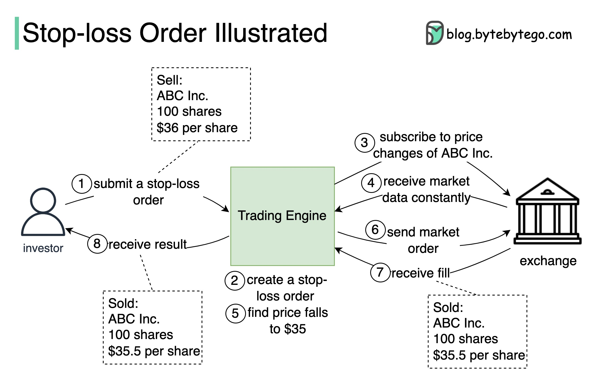

# 📉 止损单是怎么工作的？交易系统执行流程

> 设定价格，跌到就自动卖出，控制损失

止损单帮你在股价下跌时自动卖出，限制损失 👇

📌 **举例：**
持有100股ABC公司，当前$40/股，设置止损价$36

📌 **执行流程：**
1. 投资者提交止损单（100股，$36卖出）
2. 交易引擎创建止损订单
3. 交易引擎订阅ABC的实时行情
4. 检测到价格跌到$35 → 立即创建市价卖单提交到交易所
5. 订单成交（如$35.5/股），交易所返回成交报告
6. 通知投资者：100股以$35.5/股卖出

💡 止损单是风险管理的基本工具，但注意：在极端行情下可能以远低于止损价成交（滑点）。

你做过量化交易吗？👇

---

#止损单 #交易系统 #金融 #FinTech #系统设计 #风控 #投资
