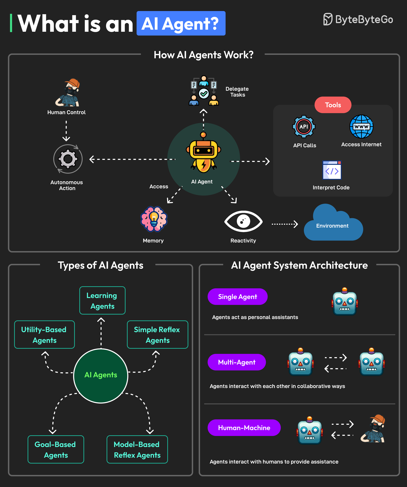

# 🤖 什么是AI Agent

> 感知环境、收集数据、自主决策、使用工具

AI Agent 是能与环境交互、收集数据、自主完成目标的软件程序 👇

📌 **核心特征：**
- 🤖 自主行动，不需要持续人工干预（也可以有人在环路中）
- 🧠 有记忆，存储偏好和知识，LLM负责信息处理和决策
- 👁️ 能感知和处理环境信息
- 🔧 能使用工具（上网、代码解释器、API调用）
- 🤝 能与其他Agent或人类协作

📌 **架构类型：**
- **单Agent** — 个人助手
- **多Agent** — 多个Agent协作或竞争
- **人机协作** — Agent和人类配合执行任务

💡 AI Agent 是2024-2025年最热的AI方向，从简单的聊天机器人到复杂的自主工作流，应用场景越来越广。

你用过哪些AI Agent？👇

---

#AIAgent #AI #LLM #人工智能 #自动化 #程序员 #技术
