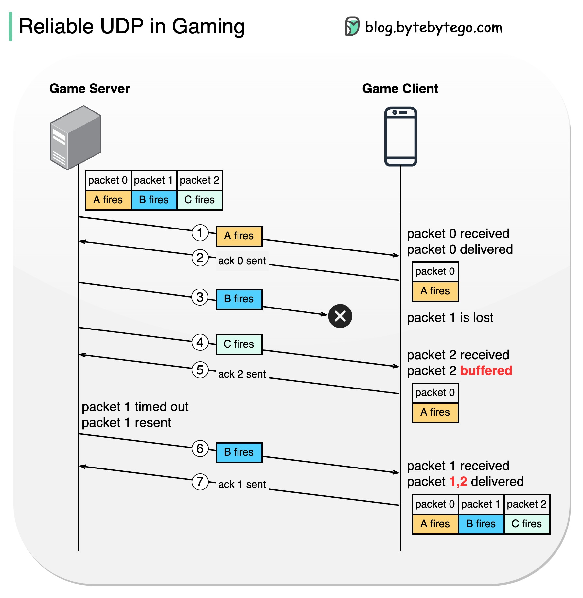

# 🎮 网络游戏用什么协议传数据

> 比TCP低延迟，比UDP更可靠

网络游戏常用 **RUDP（可靠UDP）**，在UDP基础上加可靠机制 👇

📌 **场景：** 射击游戏中A、B、C依次开枪，服务器怎么同步状态？

1️⃣ A开枪 → 包0发送成功，客户端确认
2️⃣ B开枪 → 包1传输丢失
3️⃣ C开枪 → 包2到达客户端，但包1还没到，所以包2先缓存
4️⃣ 服务器没收到包1的确认 → 重发包1
5️⃣ 客户端收到包1 → 包1和包2都变为"已送达"

💡 RUDP = UDP的低延迟 + TCP的可靠性。游戏需要的是"最终状态同步"，允许短暂的乱序但最终一致。

你玩过哪些对网络要求高的游戏？👇

---

#网络游戏 #UDP #TCP #网络协议 #游戏开发 #后端 #面试
