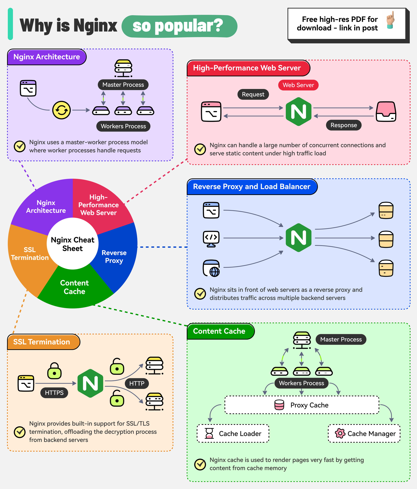

# 🌐 Nginx为什么这么受欢迎？

> Master-Worker架构 + 事件驱动非阻塞IO

Nginx 是高性能Web服务器和反向代理，为什么这么火？👇

📌 **架构：Master-Worker模型**
- Master进程负责读取配置和管理Worker
- Worker进程用事件驱动非阻塞IO处理连接

📌 **核心能力：**
- 🖥️ 高性能Web服务器
- 🔄 反向代理和负载均衡
- 💾 内容缓存
- 🔐 SSL卸载

💡 Nginx 的事件驱动架构让它能用很少的资源处理大量并发连接，这是它比Apache更受欢迎的主要原因。

你用 Nginx 做什么？👇

---

#Nginx #Web服务器 #反向代理 #负载均衡 #后端 #运维 #DevOps
