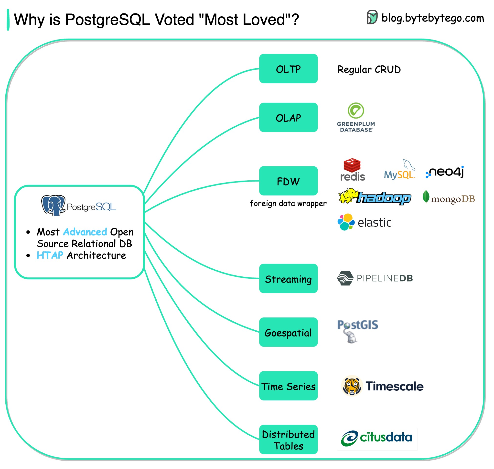

# 🐘 PostgreSQL为什么被评为最受

> 一个数据库覆盖几乎所有使用场景

StackOverflow 2022开发者调查中，PostgreSQL被评为最受喜爱的数据库。为什么？👇

📌 **OLTP** — CRUD操作，事务处理
📌 **OLAP** — 分析处理，HTAP架构同时支持事务和分析
📌 **FDW** — 外部数据包装器，跨数据库访问
📌 **Streaming** — PipelineDB扩展，实时时序聚合
📌 **Geospatial** — PostGIS扩展，地理空间查询
📌 **Time Series** — Timescale扩展，时序数据分析
📌 **Distributed** — CitusData扩展，分布式表

💡 PostgreSQL 的强大在于它的扩展机制——几乎任何场景都能通过扩展来支持。一个数据库打天下。

你用 PostgreSQL 做什么？👇

---

#PostgreSQL #数据库 #开源 #后端 #系统设计 #面试 #程序员
