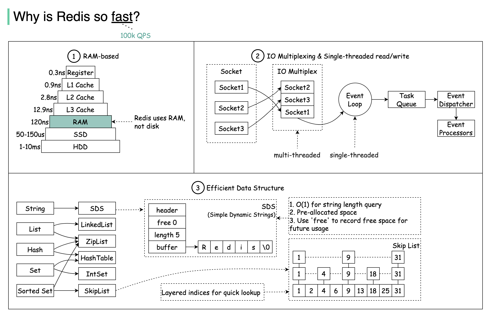

# ⚡ Redis为什么这么快？3个核心原因

> 内存存储 + IO多路复用 + 高效数据结构

Redis 的速度秘密就3个 👇

📌 **基于内存** — RAM访问比随机磁盘访问快至少1000倍

📌 **IO多路复用 + 单线程** — 用IO多路复用处理并发连接，单线程执行避免锁竞争和上下文切换

📌 **高效底层数据结构** — 跳表、压缩列表、哈希表等，针对不同场景优化

💡 很多人以为Redis快是因为"内存数据库"，但IO多路复用和高效数据结构同样关键。

你知道Redis 6.0为什么引入多线程吗？👇

---

#Redis #性能 #缓存 #内存 #数据结构 #后端 #面试
