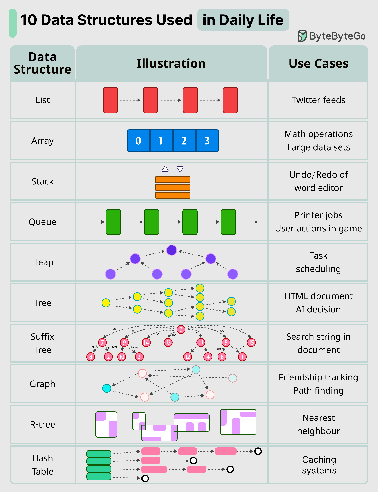

# 🧱 每天都在用的10种数据结构！你知道几个？

> 数据结构不只是面试题，它们就藏在你每天用的软件里

数据结构听起来很学术？其实你每天都在用它们，只是没意识到 👇

📌 **List 链表** — 你的推特/微博信息流就是用它实现的

📌 **Stack 栈** — Word 编辑器的撤销/重做功能

📌 **Queue 队列** — 打印任务排队、游戏中的用户操作队列

📌 **Hash Table 哈希表** — 缓存系统的核心数据结构

📌 **Array 数组** — 数学运算的基础

📌 **Heap 堆** — 任务调度，优先级队列

📌 **Tree 树** — HTML文档结构、AI决策树

📌 **Suffix Tree 后缀树** — 文档中的字符串搜索

📌 **Graph 图** — 社交关系网络、路径查找

📌 **R-Tree** — 查找最近邻居（地图类应用）

📌 **Vertex Buffer 顶点缓冲** — 向GPU发送渲染数据

💡 学数据结构不要死记硬背，结合实际应用场景理解，效果翻倍。

你在工作中最常用哪种数据结构？👇

---

#数据结构 #算法 #程序员 #编程入门 #计算机基础 #技术干货 #面试
