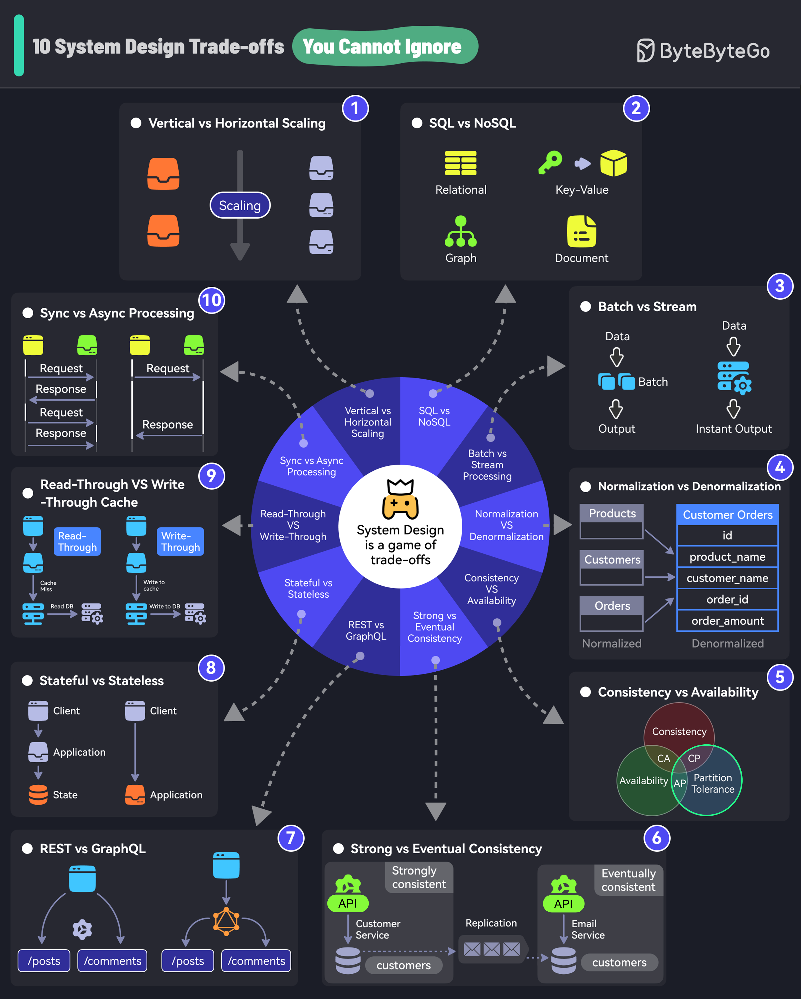

# ⚖️ 系统设计必知的10大权衡！不懂这些别说你会架构

> 系统设计的本质就是做权衡，没有银弹

不懂权衡，就不懂系统设计。这10个经典权衡你必须掌握 👇

1️⃣ **垂直扩展 vs 水平扩展** — 加配置还是加机器？小规模垂直，大规模水平

2️⃣ **SQL vs NoSQL** — 结构化数据用SQL，灵活schema用NoSQL

3️⃣ **批处理 vs 流处理** — 日账单用批处理，风控检测用流处理

4️⃣ **范式化 vs 反范式化** — 范式化减少冗余，反范式化提升查询性能

5️⃣ **一致性 vs 可用性** — CAP定理的经典抉择，鱼和熊掌不可兼得

6️⃣ **强一致性 vs 最终一致性** — 银行转账要强一致，社交点赞最终一致就行

7️⃣ **REST vs GraphQL** — REST简单直接，GraphQL灵活高效但设计成本更高

8️⃣ **有状态 vs 无状态** — 有状态记住历史，无状态更易扩展

9️⃣ **读缓存 vs 写缓存** — Read-through缓存未命中时加载数据，Write-through同时写缓存和存储

🔟 **同步 vs 异步** — 同步按顺序执行，异步后台运行不阻塞

💡 面试和实际工作中，能清晰表达这些权衡的取舍理由，就是高级工程师的标志。

---

#系统设计 #架构师 #程序员 #面试 #技术干货 #后端开发 #分布式系统
