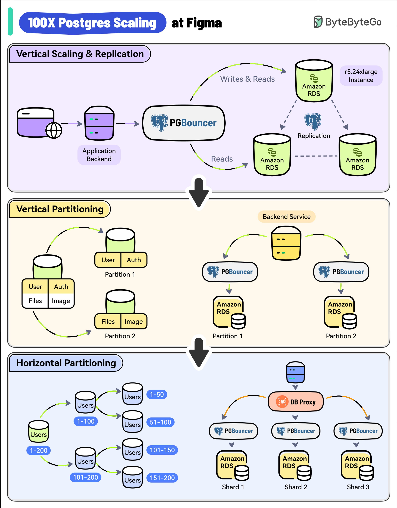

# 🚀 Figma如何把Postgres扩展

> 300万月活用户，数据库增长100倍，Figma是怎么扛住的？

Figma 用户量从2018年至今增长了200%，达到300万月活。Postgres数据库增长了100倍，他们是怎么一步步扛过来的？👇

📌 **第一阶段：垂直扩展 + 读副本**
- 用的是 Amazon RDS 单实例
- 先升级到最大规格（r5.12xlarge → r5.24xlarge）
- 创建多个读副本分担读流量
- 加 PgBouncer 做连接池，控制连接数

📌 **第二阶段：垂直分区**
- 把高流量表（如"Figma Files"、"Organizations"）迁移到独立数据库
- 多个 PgBouncer 实例管理不同数据库的连接

📌 **第三阶段：水平分区**
- 部分表超过数TB数据、数十亿行
- Postgres Vacuum 成了瓶颈，IOPS 超过 RDS 上限
- 实现水平分区，把大表拆分到多个物理数据库
- 自研 DBProxy 服务处理路由和查询

💡 扩展路径很清晰：垂直扩展 → 垂直分区 → 水平分区。每一步都是在现有方案撑不住时才升级，务实且高效。

---

#Figma #PostgreSQL #数据库 #系统设计 #扩展性 #程序员 #后端开发 #技术干货
