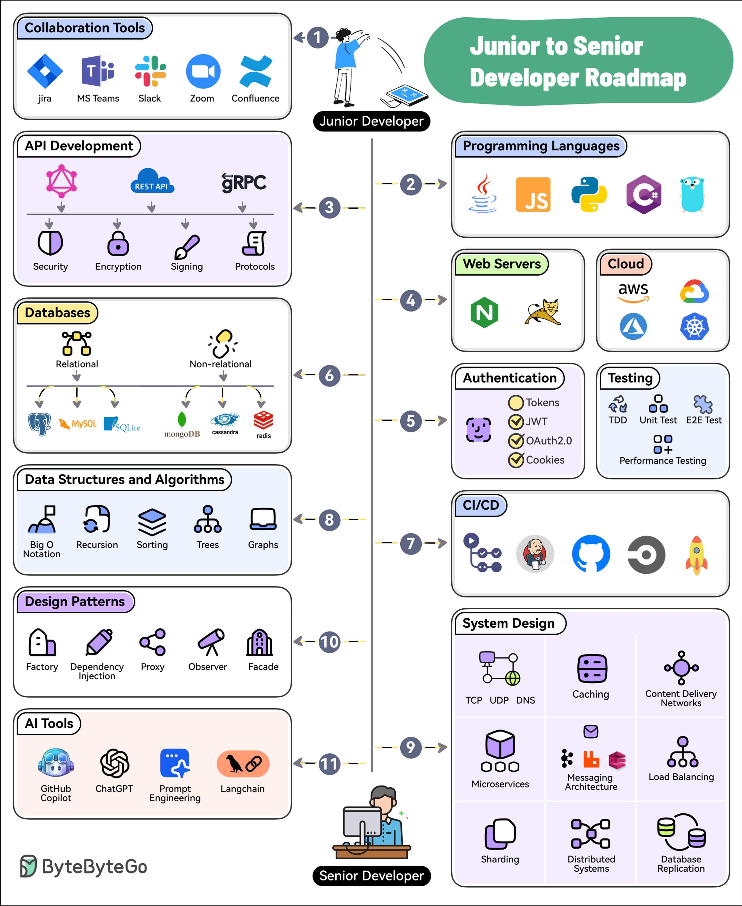

# 🎯 从初级到高级开发者的11步进阶路线图

> 不是写代码越多就越高级，方向比努力更重要

想从初级开发者晋升到高级？这11个方向帮你规划成长路径 👇

1️⃣ **协作工具** — Jira、Confluence、Slack、Teams，软件开发是团队活动

2️⃣ **编程语言** — 精通1-2门：Java、Python、JavaScript、Go 等

3️⃣ **API 开发** — 掌握 REST、GraphQL、gRPC 的设计和开发

4️⃣ **Web服务器 & 云平台** — 了解 AWS、Azure、GCP、Kubernetes

5️⃣ **认证 & 测试** — JWT、OAuth2 保障安全；TDD、E2E、性能测试保障质量

6️⃣ **数据库** — 关系型（Postgres、MySQL）+ 非关系型（MongoDB、Redis）

7️⃣ **CI/CD** — GitHub Actions、Jenkins、CircleCI，自动化是效率的关键

8️⃣ **数据结构与算法** — Big O、排序、树、图，基础功不能丢

9️⃣ **系统设计** — 网络、缓存、CDN、微服务、消息队列、负载均衡、分布式系统

🔟 **设计模式** — 依赖注入、工厂、代理、观察者、门面模式

1️⃣1️⃣ **AI 工具** — GitHub Copilot、ChatGPT、LangChain，未来的必备技能

💡 高级开发者不只是技术强，更是能看到全局、做出正确技术决策的人。

---

#程序员成长 #职业发展 #软件开发 #编程 #技术干货 #面试 #架构师
