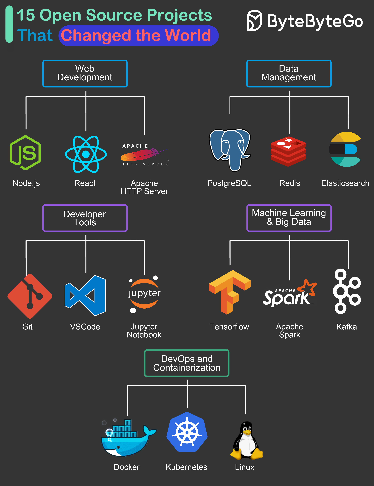

# 🌍 改变世界的15个开源项目

> 这些项目塑造了我们今天的开发方式

开源改变了软件世界。这15个项目影响力最大，按领域分类 👇

🌐 **Web 开发**
- Node.js — 把 JS 带到了服务端，前后端统一语言
- React — 成为无数Web框架的基石
- Apache HTTP Server — 企业和创业公司都爱的Web服务器

💾 **数据管理**
- PostgreSQL — 高质量的开源关系型数据库，替代昂贵的商业方案
- Redis — 缓存、消息队列、通用存储，万能选手
- Elasticsearch — 大规模数据搜索、分析和可视化

🛠️ **开发工具**
- Git — 全球开发者协作的版本控制工具
- VS Code — 全球最受欢迎的代码编辑器之一
- Jupyter Notebook — 代码、公式、可视化一体的交互式开发环境

🤖 **机器学习 & 大数据**
- TensorFlow — 机器学习的首选框架
- Apache Spark — 大数据处理和分析的标准工具
- Kafka — 实时数据管道和流处理平台

🐳 **DevOps & 容器化**
- Docker — 应用打包部署的标准方案
- Kubernetes — 云原生架构的核心，容器编排之王
- Linux — 民主化了整个软件开发世界

💡 这些项目的共同点：解决了真实痛点，社区驱动，持续进化。

---

#开源 #程序员 #技术干货 #Docker #Kubernetes #Git #Redis #Linux
