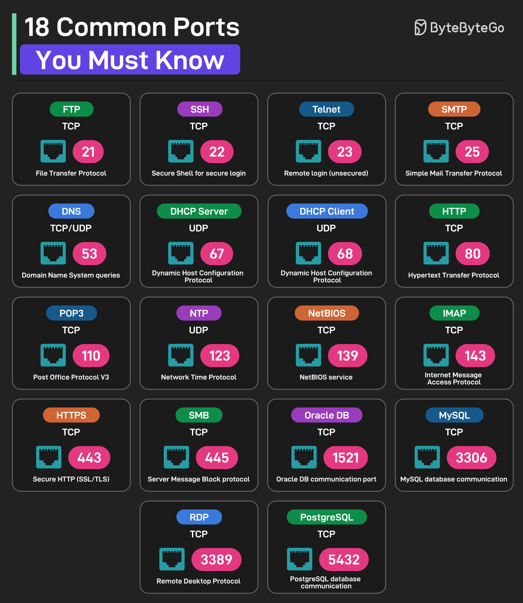

# 🔌 程序员必知的18个常用端口号！收藏备查

> 面试常考，工作常用，一图搞定

网络端口号记不住？这18个最常用的帮你整理好了 👇

📌 **21** — FTP 文件传输协议
📌 **22** — SSH 安全远程登录
📌 **23** — Telnet 远程登录（不安全）
📌 **25** — SMTP 邮件发送
📌 **53** — DNS 域名解析
📌 **67/68** — DHCP 服务端/客户端
📌 **80** — HTTP 网页访问
📌 **110** — POP3 邮件接收
📌 **123** — NTP 网络时间同步
📌 **139** — NetBIOS 网络服务
📌 **143** — IMAP 邮件访问
📌 **443** — HTTPS 安全网页访问
📌 **445** — SMB 文件共享
📌 **1521** — Oracle 数据库
📌 **3306** — MySQL 数据库
📌 **3389** — RDP 远程桌面
📌 **5432** — PostgreSQL 数据库

💡 记忆技巧：HTTP=80、HTTPS=443、SSH=22、MySQL=3306，这四个最高频，先记住这几个。

---

#网络 #端口号 #程序员 #计算机基础 #面试 #技术干货 #运维
