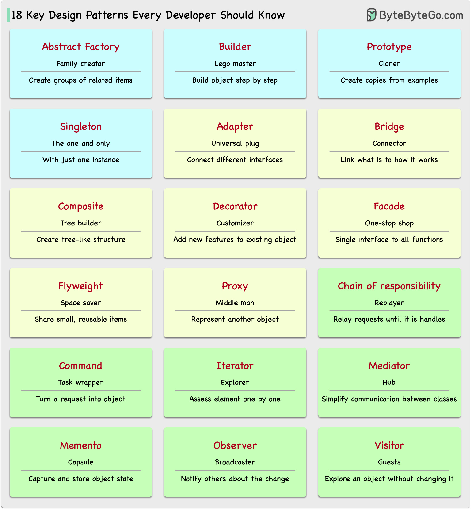

# 🎨 开发者必知的18种设计模式！一图速记

> 设计模式是解决常见问题的蓝图，用好了代码质量飞升

设计模式不用死记硬背，理解每个模式的"角色"就好 👇

🏭 **创建型模式**
- 抽象工厂 — 家族创建者，生产一组相关对象
- 建造者 — 乐高大师，一步步构建复杂对象
- 原型 — 克隆专家，复制现成的实例
- 单例 — 独一无二，全局只有一个实例

🔌 **结构型模式**
- 适配器 — 万能插头，连接不同接口
- 桥接 — 功能连接器，分离抽象和实现
- 组合 — 树形构建器，组织简单和复杂部件
- 装饰器 — 定制师，不改核心就能加功能
- 门面 — 一站式服务，简化复杂系统的接口
- 享元 — 空间节省者，高效共享小对象
- 代理 — 替身演员，控制对象的访问

🔄 **行为型模式**
- 责任链 — 请求接力，沿链传递直到被处理
- 命令 — 任务封装，把请求变成对象
- 迭代器 — 集合探索者，逐个访问元素
- 中介者 — 通信中心，简化类间交互
- 备忘录 — 时间胶囊，保存和恢复状态
- 观察者 — 新闻广播，通知变化
- 访问者 — 技能嘉宾，不改类就能加操作

💡 不需要全部用上，根据实际场景选择合适的模式才是关键。

---

#设计模式 #程序员 #软件架构 #编程 #技术干货 #面试 #代码
