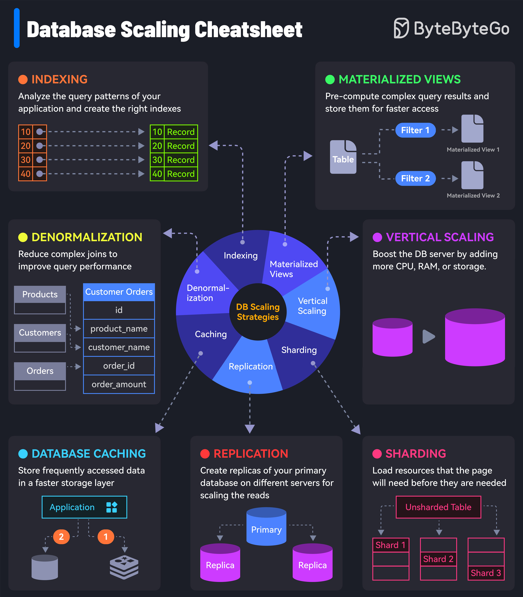

# 💾 数据库扩展的7大策略！从小项目到亿级数据

> 数据库慢了怎么办？这7招帮你搞定

数据库性能瓶颈是后端开发最常遇到的问题。这7个策略从简单到复杂，按需选用 👇

1️⃣ **索引（Indexing）** — 分析查询模式，创建合适的索引。最简单有效的优化手段

2️⃣ **物化视图（Materialized Views）** — 预计算复杂查询结果并存储，加速访问

3️⃣ **反范式化（Denormalization）** — 减少复杂JOIN，用空间换时间

4️⃣ **垂直扩展（Vertical Scaling）** — 加CPU、加内存、加存储，简单粗暴

5️⃣ **缓存（Caching）** — 热点数据放缓存层，减轻数据库压力

6️⃣ **读写分离（Replication）** — 主库写、从库读，扩展读能力

7️⃣ **分片（Sharding）** — 数据拆分到多台服务器，读写都能扩展

💡 优化顺序建议：索引 → 缓存 → 读写分离 → 分片。别一上来就分片，复杂度会指数级增长。

---

#数据库 #MySQL #PostgreSQL #系统设计 #后端开发 #程序员 #技术干货
