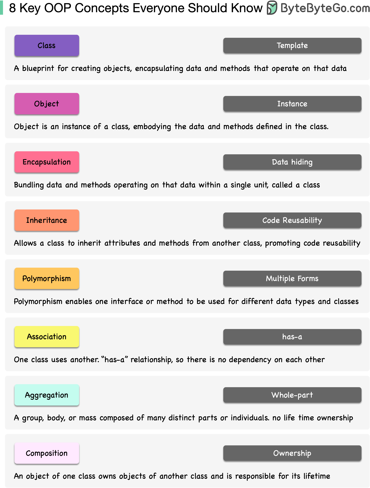

# 🧱 面向对象编程(OOP)的8个核心概念！编程基础必修

> OOP就像数字乐高，学会了就能搭出任何东西

面向对象编程从1960年代就有了，90年代随着Java和C++真正火起来。为什么重要？👇

OOP让你创建"蓝图"（类），这些数字对象知道如何互相通信，让软件运转起来。就像有一个整理好的工具箱，而不是一堆乱七八糟的工具。

核心概念：
📌 类和对象 — 蓝图和实例
📌 封装 — 隐藏内部细节，只暴露必要接口
📌 继承 — 子类复用父类的能力
📌 多态 — 同一接口，不同实现
📌 抽象 — 提取共性，忽略细节
📌 接口 — 定义行为契约
📌 组合 — 用"有一个"代替"是一个"
📌 设计原则 — SOLID等指导原则

💡 学OOP最好的方式就是动手写代码。别怕，它是你编程工具箱里最强大的工具之一。

---

#OOP #面向对象 #编程 #Java #程序员 #计算机基础 #技术干货
