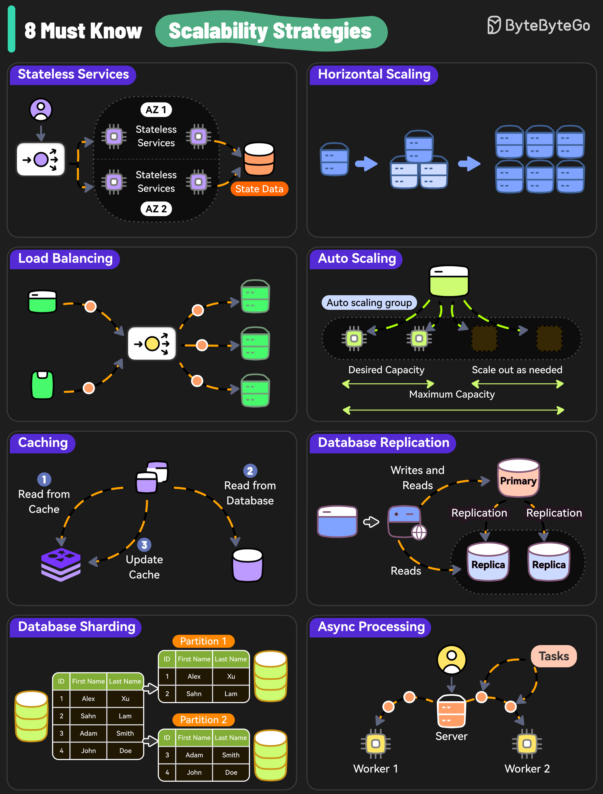

# 📈 系统扩展的8大必知策略！Amazon、Netflix都在用

> 想让系统扛住百万用户？这8招必须会

Amazon、Netflix、Uber有什么共同点？它们都极其擅长按需扩展系统 👇

1️⃣ **无状态服务** — 不依赖服务器特定数据，更容易扩展

2️⃣ **水平扩展** — 加更多服务器分担负载

3️⃣ **负载均衡** — 把请求均匀分发到多台服务器

4️⃣ **自动伸缩** — 根据实时流量自动调整资源

5️⃣ **缓存** — 减轻数据库压力，处理重复请求

6️⃣ **数据库复制** — 多节点复制数据，扩展读操作

7️⃣ **数据库分片** — 数据分布到多个实例，读写都能扩展

8️⃣ **异步处理** — 耗时任务丢给后台Worker，不阻塞新请求

💡 扩展的第一步永远是：先把服务做成无状态的。有状态的服务扩展起来会非常痛苦。

---

#系统设计 #扩展性 #架构师 #程序员 #后端开发 #技术干货 #分布式系统
