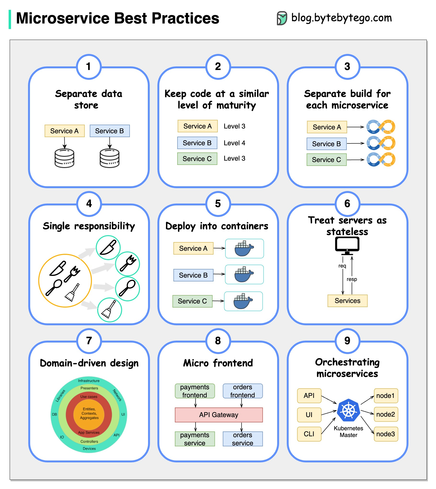

# 🛠️ 微服务开发的9条黄金法则！

> 开发微服务时必须遵循的关键实践

开发微服务时，这9条法则帮你保持代码和架构的健康 👇

1️⃣ **每个服务独立数据存储** — 数据隔离是微服务的基础

2️⃣ **保持代码成熟度一致** — 避免新旧代码混杂导致维护困难

3️⃣ **独立构建** — 每个微服务有自己的构建流程

4️⃣ **单一职责** — 一个服务只负责一个业务能力

5️⃣ **容器化部署** — 用容器保证环境一致性

6️⃣ **无状态设计** — 不在服务内保存状态，方便水平扩展

7️⃣ **领域驱动设计** — 用DDD指导服务边界划分

8️⃣ **微前端** — 前端也可以按服务拆分

9️⃣ **服务编排** — 协调多个微服务的工作流

💡 这9条和上一篇"构建微服务"的实践互补，一个偏架构设计，一个偏开发流程。

---

#微服务 #软件开发 #DDD #容器化 #程序员 #技术干货 #架构
