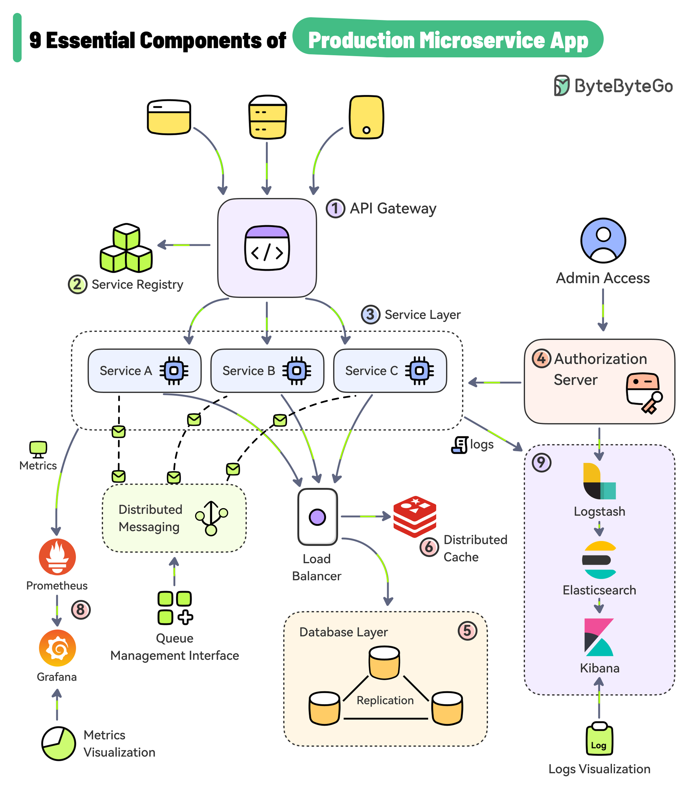

# ⚙️ 生产级微服务的9大核心组件

> 微服务不只是拆服务，还需要这些基础设施支撑

一个真正能上线的微服务系统，需要这9个核心组件 👇

1️⃣ **API网关** — 统一入口，处理路由、过滤和负载均衡

2️⃣ **服务注册中心** — 存储所有服务信息，网关通过它发现服务（Consul/Eureka/ZooKeeper）

3️⃣ **服务层** — 每个微服务负责特定业务功能，可多实例运行（Spring Boot/NestJS）

4️⃣ **认证服务器** — 管理身份和访问控制（Keycloak/Azure AD/Okta）

5️⃣ **数据存储** — PostgreSQL、MySQL等存储业务数据

6️⃣ **分布式缓存** — Redis、Memcached提升性能

7️⃣ **异步通信** — Kafka、RabbitMQ支持服务间异步消息

8️⃣ **指标可视化** — Prometheus采集 + Grafana展示

9️⃣ **日志聚合** — Logstash收集 + Elasticsearch存储 + Kibana可视化（ELK栈）

💡 这9个组件就是微服务的"全家桶"，缺一个都会在生产环境踩坑。

---

#微服务 #系统架构 #Kubernetes #程序员 #后端开发 #技术干货 #ELK
